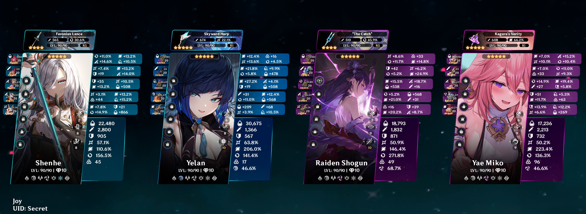
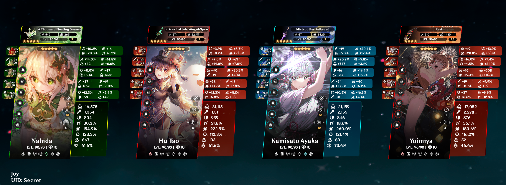

<h1 align="center">Joy's Anime Game Stats</h1>
<h3 align="center">🕒 Updated at <u>Sep 06, 2023 19:34 +0700</u></h3>
 

  

    
    Honkai Star Rail Details
  

  

    
    <h2>Info</h2>
    <table>
      <tr>
        <td>Nickname</td>
        <td>Joy</td>
      </tr>
      <tr>
        <td>Trailblaze Level</td>
        <td>67</td>
      </tr>
      <tr>
        <td>Server</td>
        <td>Asia</td>
      </tr>
    </table>
  

  

    <h2>
       Daily Rewards
    </h2>
    <table>
      <tr>
        <td>Total Rewards Claimed</td>
        <td>6</td>
      </tr>
      <tr>
        <td>Last Claimed Reward</td>
        <td>
          2 x
          
          Adventure Log
        </td>
      </tr>
    </table>
  

  

    <h2>
      
      Stats
    </h2>
    <table>
      <tr>
        <td>Days Active</td>
        <td>128</td>
      </tr>
      <tr>
        <td>Total Avatar</td>
        <td>24</td>
      </tr>
      <tr>
        <td>Total Achievement</td>
        <td>277</td>
      </tr>
      <tr>
        <td>Chests Opened</td>
        <td>323</td>
      </tr>
    </table>
  

  

    <h2> Diary</h2>
    <table>
      <tr>
        <td>
           Stellar Jade
          earned
        </td>
        <td>4395 (rate -41)</td>
      </tr>
      <tr>
        <td>
          
          Pass & Special Pass earned
        </td>
        <td>36 (rate 44)</td>
      </tr>
      <tr>
        <td>Categories</td>
        <td>
          Event: 1530 (34%) Simulated Universe: 1105 (25%) Adventure
          Rewards: 690 (15%) Forgotten Hall: 680 (15%) Daily Activity:
          360 (8%) Other: 10 (3%) Mail: 20 (0%) 
        </td>
      </tr>
    </table>
  

  

    <h2>Memory of Chaos</h2>
    <table>
      <tr>
        <td>Season</td>
        <td>1001</td>
      </tr>
      <tr>
        <td>Max Floor</td>
        <td>Ethereal Shipcraft Stage 7</td>
      </tr>
      <tr>
        <td>Total Battles</td>
        <td>9</td>
      </tr>
      <tr>
        <td>Total Stars</td>
        <td>21</td>
      </tr>
    </table>
  

  

    <h2>
      
      Characters
    </h2>
    

      
<b>Kafka </b>

       
      <table>
        <tr>
          <th><h3>Kafka</h3></th>
          <th><h3>In the Name of the World</h3></th>
        </tr>
        <tr>
          <td>
            

              
            

          </td>
          <td>
            

              
            

          </td>
        </tr>
        <tr>
          <td>
            <table>
              <tr>
                <td>Rarity</td>
                <td>★★★★★</td>
              </tr>
              <tr>
                <td>Element</td>
                <td>
                  
                </td>
              </tr>
              <tr>
                <td>Level</td>
                <td>80</td>
              </tr>
              <tr>
                <td>Eidolon</td>
                <td>0</td>
              </tr>
              <tr>
                <td>Relics</td>
                <td>
                  
                  Band's Polarized Sunglasses 
                  Band's Touring Bracelet 
                  Band's Leather Jacket With Studs 
                  Band's Ankle Boots With Rivets 
                </td>
              </tr>
              <tr>
                <td>Planar</td>
                <td>
                  
                  Herta's Space Station 
                  Herta's Wandering Trek 
                </td>
              </tr>
            </table>
          </td>
          <td valign="top">
            <table>
              <tr>
                <td>Name</td>
                <td>In the Name of the World</td>
              </tr>
              <tr>
                <td>Level</td>
                <td>80</td>
              </tr>
              <tr>
                <td>Superimpose</td>
                <td>2</td>
              </tr>
            </table>
          </td>
        </tr>
      </table>
    

    

      
<b>Seele </b>

       
      <table>
        <tr>
          <th><h3>Seele</h3></th>
          <th><h3>Cruising in the Stellar Sea</h3></th>
        </tr>
        <tr>
          <td>
            

              
            

          </td>
          <td>
            

              
            

          </td>
        </tr>
        <tr>
          <td>
            <table>
              <tr>
                <td>Rarity</td>
                <td>★★★★★</td>
              </tr>
              <tr>
                <td>Element</td>
                <td>
                  
                </td>
              </tr>
              <tr>
                <td>Level</td>
                <td>80</td>
              </tr>
              <tr>
                <td>Eidolon</td>
                <td>0</td>
              </tr>
              <tr>
                <td>Relics</td>
                <td>
                  
                  Genius's Ultraremote Sensing Visor 
                  Genius's Frequency Catcher 
                  Genius's Metafield Suit 
                  Genius's Gravity Walker 
                </td>
              </tr>
              <tr>
                <td>Planar</td>
                <td>
                  
                  Salsotto's Moving City 
                  Salsotto's Terminator Line 
                </td>
              </tr>
            </table>
          </td>
          <td valign="top">
            <table>
              <tr>
                <td>Name</td>
                <td>Cruising in the Stellar Sea</td>
              </tr>
              <tr>
                <td>Level</td>
                <td>80</td>
              </tr>
              <tr>
                <td>Superimpose</td>
                <td>5</td>
              </tr>
            </table>
          </td>
        </tr>
      </table>
    

    

      
<b>Clara </b>

       
      <table>
        <tr>
          <th><h3>Clara</h3></th>
          <th><h3>A Secret Vow</h3></th>
        </tr>
        <tr>
          <td>
            

              
            

          </td>
          <td>
            

              
            

          </td>
        </tr>
        <tr>
          <td>
            <table>
              <tr>
                <td>Rarity</td>
                <td>★★★★★</td>
              </tr>
              <tr>
                <td>Element</td>
                <td>
                  
                </td>
              </tr>
              <tr>
                <td>Level</td>
                <td>80</td>
              </tr>
              <tr>
                <td>Eidolon</td>
                <td>0</td>
              </tr>
              <tr>
                <td>Relics</td>
                <td>
                  
                  Champion's Headgear 
                  Champion's Heavy Gloves 
                  Champion's Chest Guard 
                  Champion's Fleetfoot Boots 
                </td>
              </tr>
              <tr>
                <td>Planar</td>
                <td>
                  
                  Herta's Space Station 
                  Herta's Wandering Trek 
                </td>
              </tr>
            </table>
          </td>
          <td valign="top">
            <table>
              <tr>
                <td>Name</td>
                <td>A Secret Vow</td>
              </tr>
              <tr>
                <td>Level</td>
                <td>60</td>
              </tr>
              <tr>
                <td>Superimpose</td>
                <td>2</td>
              </tr>
            </table>
          </td>
        </tr>
      </table>
    

    

      
<b>Himeko </b>

       
      <table>
        <tr>
          <th><h3>Himeko</h3></th>
          <th><h3>Make the World Clamor</h3></th>
        </tr>
        <tr>
          <td>
            

              
            

          </td>
          <td>
            

              
            

          </td>
        </tr>
        <tr>
          <td>
            <table>
              <tr>
                <td>Rarity</td>
                <td>★★★★★</td>
              </tr>
              <tr>
                <td>Element</td>
                <td>
                  
                </td>
              </tr>
              <tr>
                <td>Level</td>
                <td>60</td>
              </tr>
              <tr>
                <td>Eidolon</td>
                <td>0</td>
              </tr>
              <tr>
                <td>Relics</td>
                <td>
                  
                  Firesmith's Obsidian Goggles 
                  Firesmith's Ring of Flame-Mastery 
                  Musketeer's Wind-Hunting Shawl 
                  Firesmith's Alloy Leg 
                </td>
              </tr>
              <tr>
                <td>Planar</td>
                <td>
                  
                  Herta's Space Station 
                  Herta's Wandering Trek 
                </td>
              </tr>
            </table>
          </td>
          <td valign="top">
            <table>
              <tr>
                <td>Name</td>
                <td>Make the World Clamor</td>
              </tr>
              <tr>
                <td>Level</td>
                <td>60</td>
              </tr>
              <tr>
                <td>Superimpose</td>
                <td>4</td>
              </tr>
            </table>
          </td>
        </tr>
      </table>
    

    

      
<b>Trailblazer </b>

       
      <table>
        <tr>
          <th><h3>Trailblazer</h3></th>
          <th><h3>Landau's Choice</h3></th>
        </tr>
        <tr>
          <td>
            

              
            

          </td>
          <td>
            

              
            

          </td>
        </tr>
        <tr>
          <td>
            <table>
              <tr>
                <td>Rarity</td>
                <td>★★★★★</td>
              </tr>
              <tr>
                <td>Element</td>
                <td>
                  
                </td>
              </tr>
              <tr>
                <td>Level</td>
                <td>80</td>
              </tr>
              <tr>
                <td>Eidolon</td>
                <td>6</td>
              </tr>
              <tr>
                <td>Relics</td>
                <td>
                  
                  Knight's Forgiving Casque 
                  Knight's Silent Oath Ring 
                  Knight's Solemn Breastplate 
                  Knight's Iron Boots of Order 
                </td>
              </tr>
              <tr>
                <td>Planar</td>
                <td>
                  
                  The Xianzhou Luofu's Celestial Ark 
                  The Xianzhou Luofu's Ambrosial Arbor Vines 
                </td>
              </tr>
            </table>
          </td>
          <td valign="top">
            <table>
              <tr>
                <td>Name</td>
                <td>Landau's Choice</td>
              </tr>
              <tr>
                <td>Level</td>
                <td>70</td>
              </tr>
              <tr>
                <td>Superimpose</td>
                <td>1</td>
              </tr>
            </table>
          </td>
        </tr>
      </table>
    

    

      
<b>Dan Heng • Imbibitor Lunae </b>

       
      <table>
        <tr>
          <th><h3>Dan Heng • Imbibitor Lunae</h3></th>
          <th><h3>On the Fall of an Aeon</h3></th>
        </tr>
        <tr>
          <td>
            

              
            

          </td>
          <td>
            

              
            

          </td>
        </tr>
        <tr>
          <td>
            <table>
              <tr>
                <td>Rarity</td>
                <td>★★★★★</td>
              </tr>
              <tr>
                <td>Element</td>
                <td>
                  
                </td>
              </tr>
              <tr>
                <td>Level</td>
                <td>80</td>
              </tr>
              <tr>
                <td>Eidolon</td>
                <td>0</td>
              </tr>
              <tr>
                <td>Relics</td>
                <td>
                  
                  Musketeer's Wild Wheat Felt Hat 
                  Wastelander's Desert Terminal 
                  Wastelander's Friar Robe 
                  Musketeer's Rivets Riding Boots 
                </td>
              </tr>
              <tr>
                <td>Planar</td>
                <td>
                  
                  Taikiyan Laser Stadium 
                  Taikiyan's Arclight Race Track 
                </td>
              </tr>
            </table>
          </td>
          <td valign="top">
            <table>
              <tr>
                <td>Name</td>
                <td>On the Fall of an Aeon</td>
              </tr>
              <tr>
                <td>Level</td>
                <td>70</td>
              </tr>
              <tr>
                <td>Superimpose</td>
                <td>4</td>
              </tr>
            </table>
          </td>
        </tr>
      </table>
    

    

      
<b>Jing Yuan </b>

       
      <table>
        <tr>
          <th><h3>Jing Yuan</h3></th>
          <th><h3>The Seriousness of Breakfast</h3></th>
        </tr>
        <tr>
          <td>
            

              
            

          </td>
          <td>
            

              
            

          </td>
        </tr>
        <tr>
          <td>
            <table>
              <tr>
                <td>Rarity</td>
                <td>★★★★★</td>
              </tr>
              <tr>
                <td>Element</td>
                <td>
                  
                </td>
              </tr>
              <tr>
                <td>Level</td>
                <td>80</td>
              </tr>
              <tr>
                <td>Eidolon</td>
                <td>0</td>
              </tr>
              <tr>
                <td>Relics</td>
                <td>
                  
                  Band's Polarized Sunglasses 
                  Band's Touring Bracelet 
                  Band's Leather Jacket With Studs 
                  Band's Ankle Boots With Rivets 
                </td>
              </tr>
              <tr>
                <td>Planar</td>
                <td>
                  
                  Salsotto's Moving City 
                  Salsotto's Terminator Line 
                </td>
              </tr>
            </table>
          </td>
          <td valign="top">
            <table>
              <tr>
                <td>Name</td>
                <td>The Seriousness of Breakfast</td>
              </tr>
              <tr>
                <td>Level</td>
                <td>60</td>
              </tr>
              <tr>
                <td>Superimpose</td>
                <td>5</td>
              </tr>
            </table>
          </td>
        </tr>
      </table>
    

    

      
<b>Bronya </b>

       
      <table>
        <tr>
          <th><h3>Bronya</h3></th>
          <th><h3>Past and Future</h3></th>
        </tr>
        <tr>
          <td>
            

              
            

          </td>
          <td>
            

              
            

          </td>
        </tr>
        <tr>
          <td>
            <table>
              <tr>
                <td>Rarity</td>
                <td>★★★★★</td>
              </tr>
              <tr>
                <td>Element</td>
                <td>
                  
                </td>
              </tr>
              <tr>
                <td>Level</td>
                <td>80</td>
              </tr>
              <tr>
                <td>Eidolon</td>
                <td>0</td>
              </tr>
              <tr>
                <td>Relics</td>
                <td>
                  
                  Musketeer's Wild Wheat Felt Hat 
                  Band's Touring Bracelet 
                  Genius's Metafield Suit 
                  Guard's Silver Greaves 
                </td>
              </tr>
              <tr>
                <td>Planar</td>
                <td>
                  
                  Insumousu's Whalefall Ship 
                  Insumousu's Frayed Hawser 
                </td>
              </tr>
            </table>
          </td>
          <td valign="top">
            <table>
              <tr>
                <td>Name</td>
                <td>Past and Future</td>
              </tr>
              <tr>
                <td>Level</td>
                <td>60</td>
              </tr>
              <tr>
                <td>Superimpose</td>
                <td>3</td>
              </tr>
            </table>
          </td>
        </tr>
      </table>
    

    

      
<b>Tingyun </b>

       
      <table>
        <tr>
          <th><h3>Tingyun</h3></th>
          <th><h3>Dance! Dance! Dance!</h3></th>
        </tr>
        <tr>
          <td>
            

              
            

          </td>
          <td>
            

              
            

          </td>
        </tr>
        <tr>
          <td>
            <table>
              <tr>
                <td>Rarity</td>
                <td>★★★★</td>
              </tr>
              <tr>
                <td>Element</td>
                <td>
                  
                </td>
              </tr>
              <tr>
                <td>Level</td>
                <td>80</td>
              </tr>
              <tr>
                <td>Eidolon</td>
                <td>1</td>
              </tr>
              <tr>
                <td>Relics</td>
                <td>
                  
                  Musketeer's Wild Wheat Felt Hat 
                  Musketeer's Coarse Leather Gloves 
                  Musketeer's Wind-Hunting Shawl 
                  Genius's Gravity Walker 
                </td>
              </tr>
              <tr>
                <td>Planar</td>
                <td>
                  
                  The Xianzhou Luofu's Celestial Ark 
                  The Xianzhou Luofu's Ambrosial Arbor Vines 
                </td>
              </tr>
            </table>
          </td>
          <td valign="top">
            <table>
              <tr>
                <td>Name</td>
                <td>Dance! Dance! Dance!</td>
              </tr>
              <tr>
                <td>Level</td>
                <td>70</td>
              </tr>
              <tr>
                <td>Superimpose</td>
                <td>1</td>
              </tr>
            </table>
          </td>
        </tr>
      </table>
    

    

      
<b>Natasha </b>

       
      <table>
        <tr>
          <th><h3>Natasha</h3></th>
          <th><h3>Post-Op Conversation</h3></th>
        </tr>
        <tr>
          <td>
            

              
            

          </td>
          <td>
            

              
            

          </td>
        </tr>
        <tr>
          <td>
            <table>
              <tr>
                <td>Rarity</td>
                <td>★★★★</td>
              </tr>
              <tr>
                <td>Element</td>
                <td>
                  
                </td>
              </tr>
              <tr>
                <td>Level</td>
                <td>80</td>
              </tr>
              <tr>
                <td>Eidolon</td>
                <td>6</td>
              </tr>
              <tr>
                <td>Relics</td>
                <td>
                  
                  Passerby's Rejuvenated Wooden Hairstick 
                  Passerby's Roaming Dragon Bracer 
                  Passerby's Ragged Embroided Coat 
                  Passerby's Stygian Hiking Boots 
                </td>
              </tr>
              <tr>
                <td>Planar</td>
                <td>
                  
                  The Xianzhou Luofu's Celestial Ark 
                  The Xianzhou Luofu's Ambrosial Arbor Vines 
                </td>
              </tr>
            </table>
          </td>
          <td valign="top">
            <table>
              <tr>
                <td>Name</td>
                <td>Post-Op Conversation</td>
              </tr>
              <tr>
                <td>Level</td>
                <td>70</td>
              </tr>
              <tr>
                <td>Superimpose</td>
                <td>2</td>
              </tr>
            </table>
          </td>
        </tr>
      </table>
    

    

      
<b>Yukong </b>

       
      <table>
        <tr>
          <th><h3>Yukong</h3></th>
          <th><h3>Planetary Rendezvous</h3></th>
        </tr>
        <tr>
          <td>
            

              
            

          </td>
          <td>
            

              
            

          </td>
        </tr>
        <tr>
          <td>
            <table>
              <tr>
                <td>Rarity</td>
                <td>★★★★</td>
              </tr>
              <tr>
                <td>Element</td>
                <td>
                  
                </td>
              </tr>
              <tr>
                <td>Level</td>
                <td>70</td>
              </tr>
              <tr>
                <td>Eidolon</td>
                <td>4</td>
              </tr>
              <tr>
                <td>Relics</td>
                <td>
                  
                  Genius's Ultraremote Sensing Visor 
                  Musketeer's Coarse Leather Gloves 
                  Musketeer's Wind-Hunting Shawl 
                  Musketeer's Rivets Riding Boots 
                </td>
              </tr>
              <tr>
                <td>Planar</td>
                <td>
                  
                  Herta's Space Station 
                  Herta's Wandering Trek 
                </td>
              </tr>
            </table>
          </td>
          <td valign="top">
            <table>
              <tr>
                <td>Name</td>
                <td>Planetary Rendezvous</td>
              </tr>
              <tr>
                <td>Level</td>
                <td>40</td>
              </tr>
              <tr>
                <td>Superimpose</td>
                <td>1</td>
              </tr>
            </table>
          </td>
        </tr>
      </table>
    

    

      
<b>Sampo </b>

       
      <table>
        <tr>
          <th><h3>Sampo</h3></th>
          <th><h3>Eyes of the Prey</h3></th>
        </tr>
        <tr>
          <td>
            

              
            

          </td>
          <td>
            

              
            

          </td>
        </tr>
        <tr>
          <td>
            <table>
              <tr>
                <td>Rarity</td>
                <td>★★★★</td>
              </tr>
              <tr>
                <td>Element</td>
                <td>
                  
                </td>
              </tr>
              <tr>
                <td>Level</td>
                <td>70</td>
              </tr>
              <tr>
                <td>Eidolon</td>
                <td>2</td>
              </tr>
              <tr>
                <td>Relics</td>
                <td>
                  
                  Messenger's Holovisor 
                  Messenger's Transformative Arm 
                  Musketeer's Wind-Hunting Shawl 
                  Wastelander's Powered Greaves 
                </td>
              </tr>
              <tr>
                <td>Planar</td>
                <td>
                  
                  Herta's Space Station 
                  Herta's Wandering Trek 
                </td>
              </tr>
            </table>
          </td>
          <td valign="top">
            <table>
              <tr>
                <td>Name</td>
                <td>Eyes of the Prey</td>
              </tr>
              <tr>
                <td>Level</td>
                <td>60</td>
              </tr>
              <tr>
                <td>Superimpose</td>
                <td>2</td>
              </tr>
            </table>
          </td>
        </tr>
      </table>
    

    

      
<b>Pela </b>

       
      <table>
        <tr>
          <th><h3>Pela</h3></th>
          <th><h3>Before the Tutorial Mission Starts</h3></th>
        </tr>
        <tr>
          <td>
            

              
            

          </td>
          <td>
            

              
            

          </td>
        </tr>
        <tr>
          <td>
            <table>
              <tr>
                <td>Rarity</td>
                <td>★★★★</td>
              </tr>
              <tr>
                <td>Element</td>
                <td>
                  
                </td>
              </tr>
              <tr>
                <td>Level</td>
                <td>70</td>
              </tr>
              <tr>
                <td>Eidolon</td>
                <td>5</td>
              </tr>
              <tr>
                <td>Relics</td>
                <td>
                  
                  Musketeer's Wild Wheat Felt Hat 
                  Musketeer's Coarse Leather Gloves 
                  Musketeer's Wind-Hunting Shawl 
                  Musketeer's Rivets Riding Boots 
                </td>
              </tr>
              <tr>
                <td>Planar</td>
                <td>
                  
                  Insumousu's Whalefall Ship 
                  Insumousu's Frayed Hawser 
                </td>
              </tr>
            </table>
          </td>
          <td valign="top">
            <table>
              <tr>
                <td>Name</td>
                <td>Before the Tutorial Mission Starts</td>
              </tr>
              <tr>
                <td>Level</td>
                <td>70</td>
              </tr>
              <tr>
                <td>Superimpose</td>
                <td>5</td>
              </tr>
            </table>
          </td>
        </tr>
      </table>
    

    

      
<b>Asta </b>

       
      <table>
        <tr>
          <th><h3>Asta</h3></th>
          <th><h3>Memories of the Past</h3></th>
        </tr>
        <tr>
          <td>
            

              
            

          </td>
          <td>
            

              
            

          </td>
        </tr>
        <tr>
          <td>
            <table>
              <tr>
                <td>Rarity</td>
                <td>★★★★</td>
              </tr>
              <tr>
                <td>Element</td>
                <td>
                  
                </td>
              </tr>
              <tr>
                <td>Level</td>
                <td>70</td>
              </tr>
              <tr>
                <td>Eidolon</td>
                <td>3</td>
              </tr>
              <tr>
                <td>Relics</td>
                <td>
                  
                  Musketeer's Wild Wheat Felt Hat 
                  Hunter's Lizard Gloves 
                  Musketeer's Wind-Hunting Shawl 
                  Musketeer's Rivets Riding Boots 
                </td>
              </tr>
              <tr>
                <td>Planar</td>
                <td>
                  
                  The Xianzhou Luofu's Celestial Ark 
                  The Xianzhou Luofu's Ambrosial Arbor Vines 
                </td>
              </tr>
            </table>
          </td>
          <td valign="top">
            <table>
              <tr>
                <td>Name</td>
                <td>Memories of the Past</td>
              </tr>
              <tr>
                <td>Level</td>
                <td>60</td>
              </tr>
              <tr>
                <td>Superimpose</td>
                <td>3</td>
              </tr>
            </table>
          </td>
        </tr>
      </table>
    

    

      
<b>March 7th </b>

       
      <table>
        <tr>
          <th><h3>March 7th</h3></th>
          <th><h3></h3></th>
        </tr>
        <tr>
          <td>
            

              
            

          </td>
          <td>
            

          </td>
        </tr>
        <tr>
          <td>
            <table>
              <tr>
                <td>Rarity</td>
                <td>★★★★</td>
              </tr>
              <tr>
                <td>Element</td>
                <td>
                  
                </td>
              </tr>
              <tr>
                <td>Level</td>
                <td>70</td>
              </tr>
              <tr>
                <td>Eidolon</td>
                <td>6</td>
              </tr>
              <tr>
                <td>Relics</td>
                <td>
                  
                  Knight's Forgiving Casque 
                  Knight's Silent Oath Ring 
                  Knight's Solemn Breastplate 
                  Knight's Iron Boots of Order 
                </td>
              </tr>
              <tr>
                <td>Planar</td>
                <td>
                  
                  The Xianzhou Luofu's Celestial Ark 
                  The Xianzhou Luofu's Ambrosial Arbor Vines 
                </td>
              </tr>
            </table>
          </td>
          <td valign="top">
            <table>
              <tr>
                <td>Name</td>
                <td></td>
              </tr>
              <tr>
                <td>Level</td>
                <td></td>
              </tr>
              <tr>
                <td>Superimpose</td>
                <td></td>
              </tr>
            </table>
          </td>
        </tr>
      </table>
    

    

      
<b>Sushang </b>

       
      <table>
        <tr>
          <th><h3>Sushang</h3></th>
          <th><h3>Swordplay</h3></th>
        </tr>
        <tr>
          <td>
            

              
            

          </td>
          <td>
            

              
            

          </td>
        </tr>
        <tr>
          <td>
            <table>
              <tr>
                <td>Rarity</td>
                <td>★★★★</td>
              </tr>
              <tr>
                <td>Element</td>
                <td>
                  
                </td>
              </tr>
              <tr>
                <td>Level</td>
                <td>60</td>
              </tr>
              <tr>
                <td>Eidolon</td>
                <td>2</td>
              </tr>
              <tr>
                <td>Relics</td>
                <td>
                  
                  Thief's Myriad-Faced Mask 
                  Thief's Gloves With Prints 
                  Thief's Steel Grappling Hook 
                  Thief's Meteor Boots 
                </td>
              </tr>
              <tr>
                <td>Planar</td>
                <td>
                  
                  The IPC's Mega HQ 
                  The IPC's Trade Route 
                </td>
              </tr>
            </table>
          </td>
          <td valign="top">
            <table>
              <tr>
                <td>Name</td>
                <td>Swordplay</td>
              </tr>
              <tr>
                <td>Level</td>
                <td>50</td>
              </tr>
              <tr>
                <td>Superimpose</td>
                <td>2</td>
              </tr>
            </table>
          </td>
        </tr>
      </table>
    

    

      
<b>Serval </b>

       
      <table>
        <tr>
          <th><h3>Serval</h3></th>
          <th><h3>Sagacity</h3></th>
        </tr>
        <tr>
          <td>
            

              
            

          </td>
          <td>
            

              
            

          </td>
        </tr>
        <tr>
          <td>
            <table>
              <tr>
                <td>Rarity</td>
                <td>★★★★</td>
              </tr>
              <tr>
                <td>Element</td>
                <td>
                  
                </td>
              </tr>
              <tr>
                <td>Level</td>
                <td>60</td>
              </tr>
              <tr>
                <td>Eidolon</td>
                <td>6</td>
              </tr>
              <tr>
                <td>Relics</td>
                <td>
                  
                  Band's Polarized Sunglasses 
                  Band's Touring Bracelet 
                </td>
              </tr>
              <tr>
                <td>Planar</td>
                <td>
                  
                  Salsotto's Moving City 
                  Salsotto's Terminator Line 
                </td>
              </tr>
            </table>
          </td>
          <td valign="top">
            <table>
              <tr>
                <td>Name</td>
                <td>Sagacity</td>
              </tr>
              <tr>
                <td>Level</td>
                <td>1</td>
              </tr>
              <tr>
                <td>Superimpose</td>
                <td>1</td>
              </tr>
            </table>
          </td>
        </tr>
      </table>
    

    

      
<b>Luka </b>

       
      <table>
        <tr>
          <th><h3>Luka</h3></th>
          <th><h3>Good Night and Sleep Well</h3></th>
        </tr>
        <tr>
          <td>
            

              
            

          </td>
          <td>
            

              
            

          </td>
        </tr>
        <tr>
          <td>
            <table>
              <tr>
                <td>Rarity</td>
                <td>★★★★</td>
              </tr>
              <tr>
                <td>Element</td>
                <td>
                  
                </td>
              </tr>
              <tr>
                <td>Level</td>
                <td>59</td>
              </tr>
              <tr>
                <td>Eidolon</td>
                <td>2</td>
              </tr>
              <tr>
                <td>Relics</td>
                <td></td>
              </tr>
            </table>
          </td>
          <td valign="top">
            <table>
              <tr>
                <td>Name</td>
                <td>Good Night and Sleep Well</td>
              </tr>
              <tr>
                <td>Level</td>
                <td>1</td>
              </tr>
              <tr>
                <td>Superimpose</td>
                <td>1</td>
              </tr>
            </table>
          </td>
        </tr>
      </table>
    

    

      
<b>Gepard </b>

       
      <table>
        <tr>
          <th><h3>Gepard</h3></th>
          <th><h3>Day One of My New Life</h3></th>
        </tr>
        <tr>
          <td>
            

              
            

          </td>
          <td>
            

              
            

          </td>
        </tr>
        <tr>
          <td>
            <table>
              <tr>
                <td>Rarity</td>
                <td>★★★★★</td>
              </tr>
              <tr>
                <td>Element</td>
                <td>
                  
                </td>
              </tr>
              <tr>
                <td>Level</td>
                <td>50</td>
              </tr>
              <tr>
                <td>Eidolon</td>
                <td>0</td>
              </tr>
              <tr>
                <td>Relics</td>
                <td>
                  
                  Knight's Forgiving Casque 
                  Knight's Silent Oath Ring 
                  Knight's Solemn Breastplate 
                  Knight's Iron Boots of Order 
                </td>
              </tr>
              <tr>
                <td>Planar</td>
                <td>
                  
                  Belobog's Fortress of Preservation 
                  Belobog's Iron Defense 
                </td>
              </tr>
            </table>
          </td>
          <td valign="top">
            <table>
              <tr>
                <td>Name</td>
                <td>Day One of My New Life</td>
              </tr>
              <tr>
                <td>Level</td>
                <td>70</td>
              </tr>
              <tr>
                <td>Superimpose</td>
                <td>1</td>
              </tr>
            </table>
          </td>
        </tr>
      </table>
    

    

      
<b>Dan Heng </b>

       
      <table>
        <tr>
          <th><h3>Dan Heng</h3></th>
          <th><h3>Only Silence Remains</h3></th>
        </tr>
        <tr>
          <td>
            

              
            

          </td>
          <td>
            

              
            

          </td>
        </tr>
        <tr>
          <td>
            <table>
              <tr>
                <td>Rarity</td>
                <td>★★★★</td>
              </tr>
              <tr>
                <td>Element</td>
                <td>
                  
                </td>
              </tr>
              <tr>
                <td>Level</td>
                <td>50</td>
              </tr>
              <tr>
                <td>Eidolon</td>
                <td>3</td>
              </tr>
              <tr>
                <td>Relics</td>
                <td></td>
              </tr>
            </table>
          </td>
          <td valign="top">
            <table>
              <tr>
                <td>Name</td>
                <td>Only Silence Remains</td>
              </tr>
              <tr>
                <td>Level</td>
                <td>50</td>
              </tr>
              <tr>
                <td>Superimpose</td>
                <td>2</td>
              </tr>
            </table>
          </td>
        </tr>
      </table>
    

    

      
<b>Qingque </b>

       
      <table>
        <tr>
          <th><h3>Qingque</h3></th>
          <th><h3></h3></th>
        </tr>
        <tr>
          <td>
            

              
            

          </td>
          <td>
            

          </td>
        </tr>
        <tr>
          <td>
            <table>
              <tr>
                <td>Rarity</td>
                <td>★★★★</td>
              </tr>
              <tr>
                <td>Element</td>
                <td>
                  
                </td>
              </tr>
              <tr>
                <td>Level</td>
                <td>40</td>
              </tr>
              <tr>
                <td>Eidolon</td>
                <td>1</td>
              </tr>
              <tr>
                <td>Relics</td>
                <td></td>
              </tr>
            </table>
          </td>
          <td valign="top">
            <table>
              <tr>
                <td>Name</td>
                <td></td>
              </tr>
              <tr>
                <td>Level</td>
                <td></td>
              </tr>
              <tr>
                <td>Superimpose</td>
                <td></td>
              </tr>
            </table>
          </td>
        </tr>
      </table>
    

    

      
<b>Hook </b>

       
      <table>
        <tr>
          <th><h3>Hook</h3></th>
          <th><h3>The Moles Welcome You</h3></th>
        </tr>
        <tr>
          <td>
            

              
            

          </td>
          <td>
            

              
            

          </td>
        </tr>
        <tr>
          <td>
            <table>
              <tr>
                <td>Rarity</td>
                <td>★★★★</td>
              </tr>
              <tr>
                <td>Element</td>
                <td>
                  
                </td>
              </tr>
              <tr>
                <td>Level</td>
                <td>40</td>
              </tr>
              <tr>
                <td>Eidolon</td>
                <td>4</td>
              </tr>
              <tr>
                <td>Relics</td>
                <td></td>
              </tr>
            </table>
          </td>
          <td valign="top">
            <table>
              <tr>
                <td>Name</td>
                <td>The Moles Welcome You</td>
              </tr>
              <tr>
                <td>Level</td>
                <td>30</td>
              </tr>
              <tr>
                <td>Superimpose</td>
                <td>2</td>
              </tr>
            </table>
          </td>
        </tr>
      </table>
    

    

      
<b>Herta </b>

       
      <table>
        <tr>
          <th><h3>Herta</h3></th>
          <th><h3></h3></th>
        </tr>
        <tr>
          <td>
            

              
            

          </td>
          <td>
            

          </td>
        </tr>
        <tr>
          <td>
            <table>
              <tr>
                <td>Rarity</td>
                <td>★★★★</td>
              </tr>
              <tr>
                <td>Element</td>
                <td>
                  
                </td>
              </tr>
              <tr>
                <td>Level</td>
                <td>40</td>
              </tr>
              <tr>
                <td>Eidolon</td>
                <td>5</td>
              </tr>
              <tr>
                <td>Relics</td>
                <td></td>
              </tr>
            </table>
          </td>
          <td valign="top">
            <table>
              <tr>
                <td>Name</td>
                <td></td>
              </tr>
              <tr>
                <td>Level</td>
                <td></td>
              </tr>
              <tr>
                <td>Superimpose</td>
                <td></td>
              </tr>
            </table>
          </td>
        </tr>
      </table>
    

    

      
<b>Arlan </b>

       
      <table>
        <tr>
          <th><h3>Arlan</h3></th>
          <th><h3></h3></th>
        </tr>
        <tr>
          <td>
            

              
            

          </td>
          <td>
            

          </td>
        </tr>
        <tr>
          <td>
            <table>
              <tr>
                <td>Rarity</td>
                <td>★★★★</td>
              </tr>
              <tr>
                <td>Element</td>
                <td>
                  
                </td>
              </tr>
              <tr>
                <td>Level</td>
                <td>40</td>
              </tr>
              <tr>
                <td>Eidolon</td>
                <td>0</td>
              </tr>
              <tr>
                <td>Relics</td>
                <td></td>
              </tr>
            </table>
          </td>
          <td valign="top">
            <table>
              <tr>
                <td>Name</td>
                <td></td>
              </tr>
              <tr>
                <td>Level</td>
                <td></td>
              </tr>
              <tr>
                <td>Superimpose</td>
                <td></td>
              </tr>
            </table>
          </td>
        </tr>
      </table>
    

  

  

    
    Genshin Impact Details
  

  

    <h2>Profile</h2>
    
  

  

    <h2>
       Daily Rewards
    </h2>
    <table>
      <tr>
        <td>Total Rewards Claimed</td>
        <td>3</td>
      </tr>
      <tr>
        <td>Last Claimed Reward</td>
        <td>
          5000 x
          
          Mora
        </td>
      </tr>
    </table>
  

  

    <h2>
      
      Stats
    </h2>
    <table>
      <tr>
        <td>Achievements</td>
        <td>858</td>
      </tr>
      <tr>
        <td>Days Active</td>
        <td>775</td>
      </tr>
      <tr>
        <td>Characters</td>
        <td>54</td>
      </tr>
      <tr>
        <td>Waypoints Unlocked</td>
        <td>348</td>
      </tr>
      <tr>
        <td>Anemoculi</td>
        <td>66</td>
      </tr>
      <tr>
        <td>Geoculi</td>
        <td>131</td>
      </tr>
      <tr>
        <td>Dendroculi</td>
        <td>271</td>
      </tr>
      <tr>
        <td>Electroculi</td>
        <td>181</td>
      </tr>
      <tr>
        <td>Hydroculi</td>
        <td>85</td>
      </tr>
      <tr>
        <td>Common Chests Opened</td>
        <td>2399</td>
      </tr>
      <tr>
        <td>Exquisite Chests Opened</td>
        <td>1591</td>
      </tr>
      <tr>
        <td>Precious Chests Opened</td>
        <td>488</td>
      </tr>
      <tr>
        <td>Luxurious Chests Opened</td>
        <td>191</td>
      </tr>
      <tr>
        <td>Remarkable Chests Opened</td>
        <td>178</td>
      </tr>
      <tr>
        <td>Domains Unlocked</td>
        <td>54</td>
      </tr>
    </table>
  

  

    <h2>
      
      Exploration
    </h2>
    <table>
      <tr>
        <th>Fontaine</th>
        <th>Sumeru</th>
        <th>The Chasm: Underground Mines</th>
        <th>The Chasm</th>
        <th>Enkanomiya</th>
        <th>Inazuma</th>
        <th>Dragonspine</th>
        <th>Liyue</th>
        <th>Mondstadt</th>
      </tr>
      <tr>
        <td>
          

            
          

        </td>
        <td>
          

            
          

        </td>
        <td>
          

            
          

        </td>
        <td>
          

            
          

        </td>
        <td>
          

            
          

        </td>
        <td>
          

            
          

        </td>
        <td>
          

            
          

        </td>
        <td>
          

            
          

        </td>
        <td>
          

            
          

        </td>
      </tr>
      <tr>
        <td>
          <table>
            <tr>
              <td>Explored</td>
              <td>
                
              </td>
            </tr>
            <tr>
              <td>Reputation</td>
              <td>5</td>
            </tr>
          </table>
        </td>
        <td>
          <table>
            <tr>
              <td>Explored</td>
              <td>
                
              </td>
            </tr>
            <tr>
              <td>Reputation</td>
              <td>10</td>
            </tr>
          </table>
        </td>
        <td>
          <table>
            <tr>
              <td>Explored</td>
              <td>
                
              </td>
            </tr>
            <tr>
              <td>Offering</td>
              <td>10</td>
            </tr>
          </table>
        </td>
        <td>
          <table>
            <tr>
              <td>Explored</td>
              <td>
                
              </td>
            </tr>
            <tr>
              <td>Offering</td>
              <td>10</td>
            </tr>
          </table>
        </td>
        <td>
          <table>
            <tr>
              <td>Explored</td>
              <td>
                
              </td>
            </tr>
            <tr>
              <td>Offering</td>
              <td>0</td>
            </tr>
          </table>
        </td>
        <td>
          <table>
            <tr>
              <td>Explored</td>
              <td>
                
              </td>
            </tr>
            <tr>
              <td>Reputation</td>
              <td>10</td>
            </tr>
          </table>
        </td>
        <td>
          <table>
            <tr>
              <td>Explored</td>
              <td>
                
              </td>
            </tr>
            <tr>
              <td>Offering</td>
              <td>12</td>
            </tr>
          </table>
        </td>
        <td>
          <table>
            <tr>
              <td>Explored</td>
              <td>
                
              </td>
            </tr>
            <tr>
              <td>Reputation</td>
              <td>8</td>
            </tr>
          </table>
        </td>
        <td>
          <table>
            <tr>
              <td>Explored</td>
              <td>
                
              </td>
            </tr>
            <tr>
              <td>Reputation</td>
              <td>8</td>
            </tr>
          </table>
        </td>
      </tr>
    </table>
  

  

    <h2>
      
      Teapot
    </h2>
    <table>
      <tr>
        <td>Level</td>
        <td>10</td>
      </tr>
      <tr>
        <td>Comfort</td>
        <td>Fit for a King (21400)</td>
      </tr>
      <tr>
        <td>Items</td>
        <td>1296</td>
      </tr>
      <tr>
        <td>Visitors</td>
        <td>2</td>
      </tr>
    </table>
  

  

    <h2>
      
      Spiral Abyss
    </h2>
    <table>
      <tr>
        <td>Season</td>
        <td>77</td>
      </tr>
      <tr>
        <td>Total Battles</td>
        <td>12</td>
      </tr>
      <tr>
        <td>Total Wins</td>
        <td>12</td>
      </tr>
      <tr>
        <td>Max Floor</td>
        <td>12-3</td>
      </tr>
      <tr>
        <td>Total Stars</td>
        <td>36</td>
      </tr>
      <tr>
        <td>Most Played Characters</td>
        <td>
          
          Yelan (12) 
          Hu Tao (12) 
          Kaedehara Kazuha (12) 
          Raiden Shogun (12) 
        </td>
      </tr>
      <tr>
        <td>Most Defeats</td>
        <td>
          
          Hu Tao (32) 
        </td>
      </tr>
      <tr>
        <td>Strongest Single Strike</td>
        <td>
          
          Hu Tao (192716) 
        </td>
      </tr>
      <tr>
        <td>Most Damage Taken</td>
        <td>
          
          Yelan (39283) 
        </td>
      </tr>
      <tr>
        <td>Elemental Bursts Unleashed</td>
        <td>
          
          Kaedehara Kazuha (23) 
        </td>
      </tr>
      <tr>
        <td>Elemental Skills Cast</td>
        <td>
          
          Yae Miko (66) 
        </td>
      </tr>
    </table>
  

  

    <h2> Diary</h2>
    <table>
      <tr>
        <td>
          
          Primogems earned
        </td>
        <td>1015 (rate -89)</td>
      </tr>
      <tr>
        <td>
          
          Mora earned
        </td>
        <td>1067813 (rate -89)</td>
      </tr>
      <tr>
        <td>Categories</td>
        <td>
          Spiral Abyss: 600 (60%) Daily Activity: 240 (24%) Events:
          140 (13%) Adventure: 35 (3%) Quests: 0 (0%) Mail: 0
          (0%) Other: 0 (0%) 
        </td>
      </tr>
    </table>
  

  

    <h2>
      
      Characters
    </h2>
    

      
<b>Nahida</b>

       
      <table>
        <tr>
          <th><h3 align="center">Nahida</h3></th>
          <th><h3 align="center">A Thousand Floating Dreams</h3></th>
        </tr>
        <tr>
          <td>
            

              
            

          </td>
          <td>
            

              
            

          </td>
        </tr>
        <tr>
          <td>
            <table>
              <tr>
                <td>Rarity</td>
                <td>★★★★★</td>
              </tr>
              <tr>
                <td>Element</td>
                <td>
                  
                </td>
              </tr>
              <tr>
                <td>Level</td>
                <td>90</td>
              </tr>
              <tr>
                <td>Friendship</td>
                <td>10</td>
              </tr>
              <tr>
                <td>Constellation</td>
                <td>0</td>
              </tr>
              <tr>
                <td>
                  Artifacts 1 x Lavawalker 4 x Deepwood Memories 
                </td>
                <td>
                  
                  Lavawalker's Resolution 
                  Scholar of Vines 
                  A Time of Insight 
                  Lamp of the Lost 
                  Laurel Coronet 
                </td>
              </tr>
              <tr>
                <td>Outfits</td>
                <td></td>
              </tr>
            </table>
          </td>
          <td valign="top">
            <table>
              <tr>
                <td>Name</td>
                <td>A Thousand Floating Dreams</td>
              </tr>
              <tr>
                <td>Rarity</td>
                <td>★★★★★</td>
              </tr>
              <tr>
                <td>Level</td>
                <td>90</td>
              </tr>
              <tr>
                <td>Refinement</td>
                <td>1</td>
              </tr>
            </table>
          </td>
        </tr>
      </table>
    

    

      
<b>Raiden Shogun</b>

       
      <table>
        <tr>
          <th><h3 align="center">Raiden Shogun</h3></th>
          <th><h3 align="center">"The Catch"</h3></th>
        </tr>
        <tr>
          <td>
            

              
            

          </td>
          <td>
            

              
            

          </td>
        </tr>
        <tr>
          <td>
            <table>
              <tr>
                <td>Rarity</td>
                <td>★★★★★</td>
              </tr>
              <tr>
                <td>Element</td>
                <td>
                  
                </td>
              </tr>
              <tr>
                <td>Level</td>
                <td>90</td>
              </tr>
              <tr>
                <td>Friendship</td>
                <td>10</td>
              </tr>
              <tr>
                <td>Constellation</td>
                <td>1</td>
              </tr>
              <tr>
                <td>
                  Artifacts 4 x Emblem of Severed Fate 1 x Wanderer's
                  Troupe 
                </td>
                <td>
                  
                  Magnificent Tsuba 
                  Bard's Arrow Feather 
                  Storm Cage 
                  Scarlet Vessel 
                  Ornate Kabuto 
                </td>
              </tr>
              <tr>
                <td>Outfits</td>
                <td></td>
              </tr>
            </table>
          </td>
          <td valign="top">
            <table>
              <tr>
                <td>Name</td>
                <td>"The Catch"</td>
              </tr>
              <tr>
                <td>Rarity</td>
                <td>★★★★</td>
              </tr>
              <tr>
                <td>Level</td>
                <td>90</td>
              </tr>
              <tr>
                <td>Refinement</td>
                <td>5</td>
              </tr>
            </table>
          </td>
        </tr>
      </table>
    

    

      
<b>Yelan</b>

       
      <table>
        <tr>
          <th><h3 align="center">Yelan</h3></th>
          <th><h3 align="center">Skyward Harp</h3></th>
        </tr>
        <tr>
          <td>
            

              
            

          </td>
          <td>
            

              
            

          </td>
        </tr>
        <tr>
          <td>
            <table>
              <tr>
                <td>Rarity</td>
                <td>★★★★★</td>
              </tr>
              <tr>
                <td>Element</td>
                <td>
                  
                </td>
              </tr>
              <tr>
                <td>Level</td>
                <td>90</td>
              </tr>
              <tr>
                <td>Friendship</td>
                <td>10</td>
              </tr>
              <tr>
                <td>Constellation</td>
                <td>0</td>
              </tr>
              <tr>
                <td>
                  Artifacts 4 x Emblem of Severed Fate 1 x Retracing
                  Bolide 
                </td>
                <td>
                  
                  Magnificent Tsuba 
                  Sundered Feather 
                  Storm Cage 
                  Summer Night's Waterballoon 
                  Ornate Kabuto 
                </td>
              </tr>
              <tr>
                <td>Outfits</td>
                <td></td>
              </tr>
            </table>
          </td>
          <td valign="top">
            <table>
              <tr>
                <td>Name</td>
                <td>Skyward Harp</td>
              </tr>
              <tr>
                <td>Rarity</td>
                <td>★★★★★</td>
              </tr>
              <tr>
                <td>Level</td>
                <td>90</td>
              </tr>
              <tr>
                <td>Refinement</td>
                <td>1</td>
              </tr>
            </table>
          </td>
        </tr>
      </table>
    

    

      
<b>Yae Miko</b>

       
      <table>
        <tr>
          <th><h3 align="center">Yae Miko</h3></th>
          <th><h3 align="center">Kagura's Verity</h3></th>
        </tr>
        <tr>
          <td>
            

              
            

          </td>
          <td>
            

              
            

          </td>
        </tr>
        <tr>
          <td>
            <table>
              <tr>
                <td>Rarity</td>
                <td>★★★★★</td>
              </tr>
              <tr>
                <td>Element</td>
                <td>
                  
                </td>
              </tr>
              <tr>
                <td>Level</td>
                <td>90</td>
              </tr>
              <tr>
                <td>Friendship</td>
                <td>10</td>
              </tr>
              <tr>
                <td>Constellation</td>
                <td>0</td>
              </tr>
              <tr>
                <td>
                  Artifacts 2 x Shimenawa's Reminiscence 2 x
                  Gladiator's Finale 1 x Pale Flame 
                </td>
                <td>
                  
                  Entangling Bloom 
                  Shaft of Remembrance 
                  Gladiator's Longing 
                  Surpassing Cup 
                  Gladiator's Triumphus 
                </td>
              </tr>
              <tr>
                <td>Outfits</td>
                <td></td>
              </tr>
            </table>
          </td>
          <td valign="top">
            <table>
              <tr>
                <td>Name</td>
                <td>Kagura's Verity</td>
              </tr>
              <tr>
                <td>Rarity</td>
                <td>★★★★★</td>
              </tr>
              <tr>
                <td>Level</td>
                <td>90</td>
              </tr>
              <tr>
                <td>Refinement</td>
                <td>1</td>
              </tr>
            </table>
          </td>
        </tr>
      </table>
    

    

      
<b>Yoimiya</b>

       
      <table>
        <tr>
          <th><h3 align="center">Yoimiya</h3></th>
          <th><h3 align="center">Rust</h3></th>
        </tr>
        <tr>
          <td>
            

              
            

          </td>
          <td>
            

              
            

          </td>
        </tr>
        <tr>
          <td>
            <table>
              <tr>
                <td>Rarity</td>
                <td>★★★★★</td>
              </tr>
              <tr>
                <td>Element</td>
                <td>
                  
                </td>
              </tr>
              <tr>
                <td>Level</td>
                <td>90</td>
              </tr>
              <tr>
                <td>Friendship</td>
                <td>10</td>
              </tr>
              <tr>
                <td>Constellation</td>
                <td>0</td>
              </tr>
              <tr>
                <td>
                  Artifacts 2 x Shimenawa's Reminiscence 2 x
                  Gladiator's Finale 1 x Emblem of Severed Fate 
                </td>
                <td>
                  
                  Entangling Bloom 
                  Shaft of Remembrance 
                  Gladiator's Longing 
                  Gladiator's Intoxication 
                  Ornate Kabuto 
                </td>
              </tr>
              <tr>
                <td>Outfits</td>
                <td></td>
              </tr>
            </table>
          </td>
          <td valign="top">
            <table>
              <tr>
                <td>Name</td>
                <td>Rust</td>
              </tr>
              <tr>
                <td>Rarity</td>
                <td>★★★★</td>
              </tr>
              <tr>
                <td>Level</td>
                <td>90</td>
              </tr>
              <tr>
                <td>Refinement</td>
                <td>3</td>
              </tr>
            </table>
          </td>
        </tr>
      </table>
    

    

      
<b>Hu Tao</b>

       
      <table>
        <tr>
          <th><h3 align="center">Hu Tao</h3></th>
          <th><h3 align="center">Primordial Jade Winged-Spear</h3></th>
        </tr>
        <tr>
          <td>
            

              
            

          </td>
          <td>
            

              
            

          </td>
        </tr>
        <tr>
          <td>
            <table>
              <tr>
                <td>Rarity</td>
                <td>★★★★★</td>
              </tr>
              <tr>
                <td>Element</td>
                <td>
                  
                </td>
              </tr>
              <tr>
                <td>Level</td>
                <td>90</td>
              </tr>
              <tr>
                <td>Friendship</td>
                <td>10</td>
              </tr>
              <tr>
                <td>Constellation</td>
                <td>0</td>
              </tr>
              <tr>
                <td>
                  Artifacts 4 x Crimson Witch of Flames 1 x Heart of
                  Depth 
                </td>
                <td>
                  
                  Witch's Flower of Blaze 
                  Witch's Ever-Burning Plume 
                  Witch's End Time 
                  Goblet of Thundering Deep 
                  Witch's Scorching Hat 
                </td>
              </tr>
              <tr>
                <td>Outfits</td>
                <td></td>
              </tr>
            </table>
          </td>
          <td valign="top">
            <table>
              <tr>
                <td>Name</td>
                <td>Primordial Jade Winged-Spear</td>
              </tr>
              <tr>
                <td>Rarity</td>
                <td>★★★★★</td>
              </tr>
              <tr>
                <td>Level</td>
                <td>90</td>
              </tr>
              <tr>
                <td>Refinement</td>
                <td>1</td>
              </tr>
            </table>
          </td>
        </tr>
      </table>
    

    

      
<b>Sangonomiya Kokomi</b>

       
      <table>
        <tr>
          <th><h3 align="center">Sangonomiya Kokomi</h3></th>
          <th><h3 align="center">Thrilling Tales of Dragon Slayers</h3></th>
        </tr>
        <tr>
          <td>
            

              
            

          </td>
          <td>
            

              
            

          </td>
        </tr>
        <tr>
          <td>
            <table>
              <tr>
                <td>Rarity</td>
                <td>★★★★★</td>
              </tr>
              <tr>
                <td>Element</td>
                <td>
                  
                </td>
              </tr>
              <tr>
                <td>Level</td>
                <td>90</td>
              </tr>
              <tr>
                <td>Friendship</td>
                <td>8</td>
              </tr>
              <tr>
                <td>Constellation</td>
                <td>0</td>
              </tr>
              <tr>
                <td>
                  Artifacts 4 x Ocean-Hued Clam 1 x Heart of Depth 
                </td>
                <td>
                  
                  Sea-Dyed Blossom 
                  Deep Palace's Plume 
                  Copper Compass 
                  Pearl Cage 
                  Crown of Watatsumi 
                </td>
              </tr>
              <tr>
                <td>Outfits</td>
                <td></td>
              </tr>
            </table>
          </td>
          <td valign="top">
            <table>
              <tr>
                <td>Name</td>
                <td>Thrilling Tales of Dragon Slayers</td>
              </tr>
              <tr>
                <td>Rarity</td>
                <td>★★★</td>
              </tr>
              <tr>
                <td>Level</td>
                <td>80</td>
              </tr>
              <tr>
                <td>Refinement</td>
                <td>5</td>
              </tr>
            </table>
          </td>
        </tr>
      </table>
    

    

      
<b>Shenhe</b>

       
      <table>
        <tr>
          <th><h3 align="center">Shenhe</h3></th>
          <th><h3 align="center">Favonius Lance</h3></th>
        </tr>
        <tr>
          <td>
            

              
            

          </td>
          <td>
            

              
            

          </td>
        </tr>
        <tr>
          <td>
            <table>
              <tr>
                <td>Rarity</td>
                <td>★★★★★</td>
              </tr>
              <tr>
                <td>Element</td>
                <td>
                  
                </td>
              </tr>
              <tr>
                <td>Level</td>
                <td>90</td>
              </tr>
              <tr>
                <td>Friendship</td>
                <td>10</td>
              </tr>
              <tr>
                <td>Constellation</td>
                <td>0</td>
              </tr>
              <tr>
                <td>
                  Artifacts 3 x Gladiator's Finale 2 x Shimenawa's
                  Reminiscence 
                </td>
                <td>
                  
                  Gladiator's Nostalgia 
                  Gladiator's Destiny 
                  Gladiator's Longing 
                  Hopeful Heart 
                  Capricious Visage 
                </td>
              </tr>
              <tr>
                <td>Outfits</td>
                <td></td>
              </tr>
            </table>
          </td>
          <td valign="top">
            <table>
              <tr>
                <td>Name</td>
                <td>Favonius Lance</td>
              </tr>
              <tr>
                <td>Rarity</td>
                <td>★★★★</td>
              </tr>
              <tr>
                <td>Level</td>
                <td>90</td>
              </tr>
              <tr>
                <td>Refinement</td>
                <td>5</td>
              </tr>
            </table>
          </td>
        </tr>
      </table>
    

    

      
<b>Kamisato Ayaka</b>

       
      <table>
        <tr>
          <th><h3 align="center">Kamisato Ayaka</h3></th>
          <th><h3 align="center">Mistsplitter Reforged</h3></th>
        </tr>
        <tr>
          <td>
            

              
            

          </td>
          <td>
            

              
            

          </td>
        </tr>
        <tr>
          <td>
            <table>
              <tr>
                <td>Rarity</td>
                <td>★★★★★</td>
              </tr>
              <tr>
                <td>Element</td>
                <td>
                  
                </td>
              </tr>
              <tr>
                <td>Level</td>
                <td>90</td>
              </tr>
              <tr>
                <td>Friendship</td>
                <td>10</td>
              </tr>
              <tr>
                <td>Constellation</td>
                <td>0</td>
              </tr>
              <tr>
                <td>
                  Artifacts 4 x Blizzard Strayer 1 x Emblem of Severed
                  Fate 
                </td>
                <td>
                  
                  Snowswept Memory 
                  Icebreaker's Resolve 
                  Frozen Homeland's Demise 
                  Scarlet Vessel 
                  Broken Rime's Echo 
                </td>
              </tr>
              <tr>
                <td>Outfits</td>
                <td></td>
              </tr>
            </table>
          </td>
          <td valign="top">
            <table>
              <tr>
                <td>Name</td>
                <td>Mistsplitter Reforged</td>
              </tr>
              <tr>
                <td>Rarity</td>
                <td>★★★★★</td>
              </tr>
              <tr>
                <td>Level</td>
                <td>90</td>
              </tr>
              <tr>
                <td>Refinement</td>
                <td>1</td>
              </tr>
            </table>
          </td>
        </tr>
      </table>
    

    

      
<b>Kaedehara Kazuha</b>

       
      <table>
        <tr>
          <th><h3 align="center">Kaedehara Kazuha</h3></th>
          <th><h3 align="center">Primordial Jade Cutter</h3></th>
        </tr>
        <tr>
          <td>
            

              
            

          </td>
          <td>
            

              
            

          </td>
        </tr>
        <tr>
          <td>
            <table>
              <tr>
                <td>Rarity</td>
                <td>★★★★★</td>
              </tr>
              <tr>
                <td>Element</td>
                <td>
                  
                </td>
              </tr>
              <tr>
                <td>Level</td>
                <td>90</td>
              </tr>
              <tr>
                <td>Friendship</td>
                <td>10</td>
              </tr>
              <tr>
                <td>Constellation</td>
                <td>0</td>
              </tr>
              <tr>
                <td>Artifacts 5 x Viridescent Venerer </td>
                <td>
                  
                  In Remembrance of Viridescent Fields 
                  Viridescent Arrow Feather 
                  Viridescent Venerer's Determination 
                  Viridescent Venerer's Vessel 
                  Viridescent Venerer's Diadem 
                </td>
              </tr>
              <tr>
                <td>Outfits</td>
                <td></td>
              </tr>
            </table>
          </td>
          <td valign="top">
            <table>
              <tr>
                <td>Name</td>
                <td>Primordial Jade Cutter</td>
              </tr>
              <tr>
                <td>Rarity</td>
                <td>★★★★★</td>
              </tr>
              <tr>
                <td>Level</td>
                <td>90</td>
              </tr>
              <tr>
                <td>Refinement</td>
                <td>1</td>
              </tr>
            </table>
          </td>
        </tr>
      </table>
    

    

      
<b>Wanderer</b>

       
      <table>
        <tr>
          <th><h3 align="center">Wanderer</h3></th>
          <th><h3 align="center">The Widsith</h3></th>
        </tr>
        <tr>
          <td>
            

              
            

          </td>
          <td>
            

              
            

          </td>
        </tr>
        <tr>
          <td>
            <table>
              <tr>
                <td>Rarity</td>
                <td>★★★★★</td>
              </tr>
              <tr>
                <td>Element</td>
                <td>
                  
                </td>
              </tr>
              <tr>
                <td>Level</td>
                <td>90</td>
              </tr>
              <tr>
                <td>Friendship</td>
                <td>10</td>
              </tr>
              <tr>
                <td>Constellation</td>
                <td>0</td>
              </tr>
              <tr>
                <td>
                  Artifacts 2 x Desert Pavilion Chronicle 2 x
                  Gladiator's Finale 1 x Wanderer's Troupe 
                </td>
                <td>
                  
                  The First Days of the City of Kings 
                  End of the Golden Realm 
                  Gladiator's Longing 
                  Gladiator's Intoxication 
                  Conductor's Top Hat 
                </td>
              </tr>
              <tr>
                <td>Outfits</td>
                <td></td>
              </tr>
            </table>
          </td>
          <td valign="top">
            <table>
              <tr>
                <td>Name</td>
                <td>The Widsith</td>
              </tr>
              <tr>
                <td>Rarity</td>
                <td>★★★★</td>
              </tr>
              <tr>
                <td>Level</td>
                <td>80</td>
              </tr>
              <tr>
                <td>Refinement</td>
                <td>4</td>
              </tr>
            </table>
          </td>
        </tr>
      </table>
    

    

      
<b>Baizhu</b>

       
      <table>
        <tr>
          <th><h3 align="center">Baizhu</h3></th>
          <th><h3 align="center">Prototype Amber</h3></th>
        </tr>
        <tr>
          <td>
            

              
            

          </td>
          <td>
            

              
            

          </td>
        </tr>
        <tr>
          <td>
            <table>
              <tr>
                <td>Rarity</td>
                <td>★★★★★</td>
              </tr>
              <tr>
                <td>Element</td>
                <td>
                  
                </td>
              </tr>
              <tr>
                <td>Level</td>
                <td>90</td>
              </tr>
              <tr>
                <td>Friendship</td>
                <td>10</td>
              </tr>
              <tr>
                <td>Constellation</td>
                <td>0</td>
              </tr>
              <tr>
                <td>
                  Artifacts 4 x Deepwood Memories 1 x Emblem of
                  Severed Fate 
                </td>
                <td>
                  
                  Labyrinth Wayfarer 
                  Scholar of Vines 
                  A Time of Insight 
                  Scarlet Vessel 
                  Laurel Coronet 
                </td>
              </tr>
              <tr>
                <td>Outfits</td>
                <td></td>
              </tr>
            </table>
          </td>
          <td valign="top">
            <table>
              <tr>
                <td>Name</td>
                <td>Prototype Amber</td>
              </tr>
              <tr>
                <td>Rarity</td>
                <td>★★★★</td>
              </tr>
              <tr>
                <td>Level</td>
                <td>80</td>
              </tr>
              <tr>
                <td>Refinement</td>
                <td>1</td>
              </tr>
            </table>
          </td>
        </tr>
      </table>
    

    

      
<b>Bennett</b>

       
      <table>
        <tr>
          <th><h3 align="center">Bennett</h3></th>
          <th><h3 align="center">Aquila Favonia</h3></th>
        </tr>
        <tr>
          <td>
            

              
            

          </td>
          <td>
            

              
            

          </td>
        </tr>
        <tr>
          <td>
            <table>
              <tr>
                <td>Rarity</td>
                <td>★★★★</td>
              </tr>
              <tr>
                <td>Element</td>
                <td>
                  
                </td>
              </tr>
              <tr>
                <td>Level</td>
                <td>90</td>
              </tr>
              <tr>
                <td>Friendship</td>
                <td>10</td>
              </tr>
              <tr>
                <td>Constellation</td>
                <td>5</td>
              </tr>
              <tr>
                <td>
                  Artifacts 3 x Noblesse Oblige 2 x Emblem of Severed
                  Fate 
                </td>
                <td>
                  
                  Royal Flora 
                  Royal Plume 
                  Royal Pocket Watch 
                  Scarlet Vessel 
                  Ornate Kabuto 
                </td>
              </tr>
              <tr>
                <td>Outfits</td>
                <td></td>
              </tr>
            </table>
          </td>
          <td valign="top">
            <table>
              <tr>
                <td>Name</td>
                <td>Aquila Favonia</td>
              </tr>
              <tr>
                <td>Rarity</td>
                <td>★★★★★</td>
              </tr>
              <tr>
                <td>Level</td>
                <td>90</td>
              </tr>
              <tr>
                <td>Refinement</td>
                <td>1</td>
              </tr>
            </table>
          </td>
        </tr>
      </table>
    

    

      
<b>Yanfei</b>

       
      <table>
        <tr>
          <th><h3 align="center">Yanfei</h3></th>
          <th><h3 align="center">Dodoco Tales</h3></th>
        </tr>
        <tr>
          <td>
            

              
            

          </td>
          <td>
            

              
            

          </td>
        </tr>
        <tr>
          <td>
            <table>
              <tr>
                <td>Rarity</td>
                <td>★★★★</td>
              </tr>
              <tr>
                <td>Element</td>
                <td>
                  
                </td>
              </tr>
              <tr>
                <td>Level</td>
                <td>90</td>
              </tr>
              <tr>
                <td>Friendship</td>
                <td>10</td>
              </tr>
              <tr>
                <td>Constellation</td>
                <td>4</td>
              </tr>
              <tr>
                <td>Artifacts 4 x Wanderer's Troupe </td>
                <td>
                  
                  Troupe's Dawnlight 
                  Bard's Arrow Feather 
                  Concert's Final Hour 
                  Conductor's Top Hat 
                </td>
              </tr>
              <tr>
                <td>Outfits</td>
                <td></td>
              </tr>
            </table>
          </td>
          <td valign="top">
            <table>
              <tr>
                <td>Name</td>
                <td>Dodoco Tales</td>
              </tr>
              <tr>
                <td>Rarity</td>
                <td>★★★★</td>
              </tr>
              <tr>
                <td>Level</td>
                <td>80</td>
              </tr>
              <tr>
                <td>Refinement</td>
                <td>3</td>
              </tr>
            </table>
          </td>
        </tr>
      </table>
    

    

      
<b>Diluc</b>

       
      <table>
        <tr>
          <th><h3 align="center">Diluc</h3></th>
          <th><h3 align="center">The Unforged</h3></th>
        </tr>
        <tr>
          <td>
            

              
            

          </td>
          <td>
            

              
            

          </td>
        </tr>
        <tr>
          <td>
            <table>
              <tr>
                <td>Rarity</td>
                <td>★★★★★</td>
              </tr>
              <tr>
                <td>Element</td>
                <td>
                  
                </td>
              </tr>
              <tr>
                <td>Level</td>
                <td>80</td>
              </tr>
              <tr>
                <td>Friendship</td>
                <td>10</td>
              </tr>
              <tr>
                <td>Constellation</td>
                <td>1</td>
              </tr>
              <tr>
                <td>Artifacts </td>
                <td></td>
              </tr>
              <tr>
                <td>Outfits</td>
                <td></td>
              </tr>
            </table>
          </td>
          <td valign="top">
            <table>
              <tr>
                <td>Name</td>
                <td>The Unforged</td>
              </tr>
              <tr>
                <td>Rarity</td>
                <td>★★★★★</td>
              </tr>
              <tr>
                <td>Level</td>
                <td>50</td>
              </tr>
              <tr>
                <td>Refinement</td>
                <td>1</td>
              </tr>
            </table>
          </td>
        </tr>
      </table>
    

    

      
<b>Qiqi</b>

       
      <table>
        <tr>
          <th><h3 align="center">Qiqi</h3></th>
          <th><h3 align="center">Aquila Favonia</h3></th>
        </tr>
        <tr>
          <td>
            

              
            

          </td>
          <td>
            

              
            

          </td>
        </tr>
        <tr>
          <td>
            <table>
              <tr>
                <td>Rarity</td>
                <td>★★★★★</td>
              </tr>
              <tr>
                <td>Element</td>
                <td>
                  
                </td>
              </tr>
              <tr>
                <td>Level</td>
                <td>80</td>
              </tr>
              <tr>
                <td>Friendship</td>
                <td>10</td>
              </tr>
              <tr>
                <td>Constellation</td>
                <td>1</td>
              </tr>
              <tr>
                <td>Artifacts 4 x Maiden Beloved </td>
                <td>
                  
                  Maiden's Distant Love 
                  Maiden's Heart-Stricken Infatuation 
                  Maiden's Fleeting Leisure 
                  Maiden's Fading Beauty 
                </td>
              </tr>
              <tr>
                <td>Outfits</td>
                <td></td>
              </tr>
            </table>
          </td>
          <td valign="top">
            <table>
              <tr>
                <td>Name</td>
                <td>Aquila Favonia</td>
              </tr>
              <tr>
                <td>Rarity</td>
                <td>★★★★★</td>
              </tr>
              <tr>
                <td>Level</td>
                <td>50</td>
              </tr>
              <tr>
                <td>Refinement</td>
                <td>1</td>
              </tr>
            </table>
          </td>
        </tr>
      </table>
    

    

      
<b>Mona</b>

       
      <table>
        <tr>
          <th><h3 align="center">Mona</h3></th>
          <th><h3 align="center">Thrilling Tales of Dragon Slayers</h3></th>
        </tr>
        <tr>
          <td>
            

              
            

          </td>
          <td>
            

              
            

          </td>
        </tr>
        <tr>
          <td>
            <table>
              <tr>
                <td>Rarity</td>
                <td>★★★★★</td>
              </tr>
              <tr>
                <td>Element</td>
                <td>
                  
                </td>
              </tr>
              <tr>
                <td>Level</td>
                <td>80</td>
              </tr>
              <tr>
                <td>Friendship</td>
                <td>10</td>
              </tr>
              <tr>
                <td>Constellation</td>
                <td>2</td>
              </tr>
              <tr>
                <td>Artifacts 5 x Instructor </td>
                <td>
                  
                  Instructor's Brooch 
                  Instructor's Feather Accessory 
                  Instructor's Pocket Watch 
                  Instructor's Tea Cup 
                  Instructor's Cap 
                </td>
              </tr>
              <tr>
                <td>Outfits</td>
                <td>Pact of Stars and Moon</td>
              </tr>
            </table>
          </td>
          <td valign="top">
            <table>
              <tr>
                <td>Name</td>
                <td>Thrilling Tales of Dragon Slayers</td>
              </tr>
              <tr>
                <td>Rarity</td>
                <td>★★★</td>
              </tr>
              <tr>
                <td>Level</td>
                <td>1</td>
              </tr>
              <tr>
                <td>Refinement</td>
                <td>5</td>
              </tr>
            </table>
          </td>
        </tr>
      </table>
    

    

      
<b>Keqing</b>

       
      <table>
        <tr>
          <th><h3 align="center">Keqing</h3></th>
          <th><h3 align="center">Lion's Roar</h3></th>
        </tr>
        <tr>
          <td>
            

              
            

          </td>
          <td>
            

              
            

          </td>
        </tr>
        <tr>
          <td>
            <table>
              <tr>
                <td>Rarity</td>
                <td>★★★★★</td>
              </tr>
              <tr>
                <td>Element</td>
                <td>
                  
                </td>
              </tr>
              <tr>
                <td>Level</td>
                <td>80</td>
              </tr>
              <tr>
                <td>Friendship</td>
                <td>10</td>
              </tr>
              <tr>
                <td>Constellation</td>
                <td>0</td>
              </tr>
              <tr>
                <td>
                  Artifacts 1 x Shimenawa's Reminiscence 1 x Deepwood
                  Memories 2 x Gladiator's Finale 1 x Crimson Witch of
                  Flames 
                </td>
                <td>
                  
                  Entangling Bloom 
                  Scholar of Vines 
                  Gladiator's Longing 
                  Gladiator's Intoxication 
                  Witch's Scorching Hat 
                </td>
              </tr>
              <tr>
                <td>Outfits</td>
                <td></td>
              </tr>
            </table>
          </td>
          <td valign="top">
            <table>
              <tr>
                <td>Name</td>
                <td>Lion's Roar</td>
              </tr>
              <tr>
                <td>Rarity</td>
                <td>★★★★</td>
              </tr>
              <tr>
                <td>Level</td>
                <td>80</td>
              </tr>
              <tr>
                <td>Refinement</td>
                <td>3</td>
              </tr>
            </table>
          </td>
        </tr>
      </table>
    

    

      
<b>Barbara</b>

       
      <table>
        <tr>
          <th><h3 align="center">Barbara</h3></th>
          <th><h3 align="center">Oathsworn Eye</h3></th>
        </tr>
        <tr>
          <td>
            

              
            

          </td>
          <td>
            

              
            

          </td>
        </tr>
        <tr>
          <td>
            <table>
              <tr>
                <td>Rarity</td>
                <td>★★★★</td>
              </tr>
              <tr>
                <td>Element</td>
                <td>
                  
                </td>
              </tr>
              <tr>
                <td>Level</td>
                <td>80</td>
              </tr>
              <tr>
                <td>Friendship</td>
                <td>10</td>
              </tr>
              <tr>
                <td>Constellation</td>
                <td>4</td>
              </tr>
              <tr>
                <td>
                  Artifacts 1 x Blizzard Strayer 1 x Ocean-Hued
                  Clam 
                </td>
                <td>
                  
                  Frozen Homeland's Demise 
                  Crown of Watatsumi 
                </td>
              </tr>
              <tr>
                <td>Outfits</td>
                <td>Summertime Sparkle</td>
              </tr>
            </table>
          </td>
          <td valign="top">
            <table>
              <tr>
                <td>Name</td>
                <td>Oathsworn Eye</td>
              </tr>
              <tr>
                <td>Rarity</td>
                <td>★★★★</td>
              </tr>
              <tr>
                <td>Level</td>
                <td>1</td>
              </tr>
              <tr>
                <td>Refinement</td>
                <td>5</td>
              </tr>
            </table>
          </td>
        </tr>
      </table>
    

    

      
<b>Xiangling</b>

       
      <table>
        <tr>
          <th><h3 align="center">Xiangling</h3></th>
          <th><h3 align="center">Dragon's Bane</h3></th>
        </tr>
        <tr>
          <td>
            

              
            

          </td>
          <td>
            

              
            

          </td>
        </tr>
        <tr>
          <td>
            <table>
              <tr>
                <td>Rarity</td>
                <td>★★★★</td>
              </tr>
              <tr>
                <td>Element</td>
                <td>
                  
                </td>
              </tr>
              <tr>
                <td>Level</td>
                <td>80</td>
              </tr>
              <tr>
                <td>Friendship</td>
                <td>10</td>
              </tr>
              <tr>
                <td>Constellation</td>
                <td>5</td>
              </tr>
              <tr>
                <td>
                  Artifacts 4 x Emblem of Severed Fate 1 x Desert
                  Pavilion Chronicle 
                </td>
                <td>
                  
                  Magnificent Tsuba 
                  Sundered Feather 
                  Timepiece of the Lost Path 
                  Scarlet Vessel 
                  Ornate Kabuto 
                </td>
              </tr>
              <tr>
                <td>Outfits</td>
                <td></td>
              </tr>
            </table>
          </td>
          <td valign="top">
            <table>
              <tr>
                <td>Name</td>
                <td>Dragon's Bane</td>
              </tr>
              <tr>
                <td>Rarity</td>
                <td>★★★★</td>
              </tr>
              <tr>
                <td>Level</td>
                <td>90</td>
              </tr>
              <tr>
                <td>Refinement</td>
                <td>4</td>
              </tr>
            </table>
          </td>
        </tr>
      </table>
    

    

      
<b>Xingqiu</b>

       
      <table>
        <tr>
          <th><h3 align="center">Xingqiu</h3></th>
          <th><h3 align="center">Sacrificial Sword</h3></th>
        </tr>
        <tr>
          <td>
            

              
            

          </td>
          <td>
            

              
            

          </td>
        </tr>
        <tr>
          <td>
            <table>
              <tr>
                <td>Rarity</td>
                <td>★★★★</td>
              </tr>
              <tr>
                <td>Element</td>
                <td>
                  
                </td>
              </tr>
              <tr>
                <td>Level</td>
                <td>80</td>
              </tr>
              <tr>
                <td>Friendship</td>
                <td>10</td>
              </tr>
              <tr>
                <td>Constellation</td>
                <td>5</td>
              </tr>
              <tr>
                <td>
                  Artifacts 4 x Emblem of Severed Fate 1 x Gilded
                  Dreams 
                </td>
                <td>
                  
                  Magnificent Tsuba 
                  Sundered Feather 
                  Storm Cage 
                  Scarlet Vessel 
                  Shadow of the Sand King 
                </td>
              </tr>
              <tr>
                <td>Outfits</td>
                <td></td>
              </tr>
            </table>
          </td>
          <td valign="top">
            <table>
              <tr>
                <td>Name</td>
                <td>Sacrificial Sword</td>
              </tr>
              <tr>
                <td>Rarity</td>
                <td>★★★★</td>
              </tr>
              <tr>
                <td>Level</td>
                <td>80</td>
              </tr>
              <tr>
                <td>Refinement</td>
                <td>4</td>
              </tr>
            </table>
          </td>
        </tr>
      </table>
    

    

      
<b>Ningguang</b>

       
      <table>
        <tr>
          <th><h3 align="center">Ningguang</h3></th>
          <th><h3 align="center">Skyward Atlas</h3></th>
        </tr>
        <tr>
          <td>
            

              
            

          </td>
          <td>
            

              
            

          </td>
        </tr>
        <tr>
          <td>
            <table>
              <tr>
                <td>Rarity</td>
                <td>★★★★</td>
              </tr>
              <tr>
                <td>Element</td>
                <td>
                  
                </td>
              </tr>
              <tr>
                <td>Level</td>
                <td>80</td>
              </tr>
              <tr>
                <td>Friendship</td>
                <td>10</td>
              </tr>
              <tr>
                <td>Constellation</td>
                <td>6</td>
              </tr>
              <tr>
                <td>
                  Artifacts 2 x Shimenawa's Reminiscence 1 x Crimson
                  Witch of Flames 1 x Gladiator's Finale 
                </td>
                <td>
                  
                  Entangling Bloom 
                  Witch's End Time 
                  Gladiator's Intoxication 
                  Capricious Visage 
                </td>
              </tr>
              <tr>
                <td>Outfits</td>
                <td>Orchid's Evening Gown</td>
              </tr>
            </table>
          </td>
          <td valign="top">
            <table>
              <tr>
                <td>Name</td>
                <td>Skyward Atlas</td>
              </tr>
              <tr>
                <td>Rarity</td>
                <td>★★★★★</td>
              </tr>
              <tr>
                <td>Level</td>
                <td>90</td>
              </tr>
              <tr>
                <td>Refinement</td>
                <td>1</td>
              </tr>
            </table>
          </td>
        </tr>
      </table>
    

    

      
<b>Rosaria</b>

       
      <table>
        <tr>
          <th><h3 align="center">Rosaria</h3></th>
          <th><h3 align="center">Favonius Lance</h3></th>
        </tr>
        <tr>
          <td>
            

              
            

          </td>
          <td>
            

              
            

          </td>
        </tr>
        <tr>
          <td>
            <table>
              <tr>
                <td>Rarity</td>
                <td>★★★★</td>
              </tr>
              <tr>
                <td>Element</td>
                <td>
                  
                </td>
              </tr>
              <tr>
                <td>Level</td>
                <td>80</td>
              </tr>
              <tr>
                <td>Friendship</td>
                <td>10</td>
              </tr>
              <tr>
                <td>Constellation</td>
                <td>6</td>
              </tr>
              <tr>
                <td>
                  Artifacts 4 x Emblem of Severed Fate 1 x
                  Lavawalker 
                </td>
                <td>
                  
                  Magnificent Tsuba 
                  Sundered Feather 
                  Storm Cage 
                  Scarlet Vessel 
                  Lavawalker's Wisdom 
                </td>
              </tr>
              <tr>
                <td>Outfits</td>
                <td>To the Church's Free Spirit</td>
              </tr>
            </table>
          </td>
          <td valign="top">
            <table>
              <tr>
                <td>Name</td>
                <td>Favonius Lance</td>
              </tr>
              <tr>
                <td>Rarity</td>
                <td>★★★★</td>
              </tr>
              <tr>
                <td>Level</td>
                <td>70</td>
              </tr>
              <tr>
                <td>Refinement</td>
                <td>5</td>
              </tr>
            </table>
          </td>
        </tr>
      </table>
    

    

      
<b>Traveler</b>

       
      <table>
        <tr>
          <th><h3 align="center">Traveler</h3></th>
          <th><h3 align="center">Skyward Blade</h3></th>
        </tr>
        <tr>
          <td>
            

              
            

          </td>
          <td>
            

              
            

          </td>
        </tr>
        <tr>
          <td>
            <table>
              <tr>
                <td>Rarity</td>
                <td>★★★★★</td>
              </tr>
              <tr>
                <td>Element</td>
                <td>
                  
                </td>
              </tr>
              <tr>
                <td>Level</td>
                <td>80</td>
              </tr>
              <tr>
                <td>Friendship</td>
                <td>0</td>
              </tr>
              <tr>
                <td>Constellation</td>
                <td>2</td>
              </tr>
              <tr>
                <td>
                  Artifacts 1 x Gladiator's Finale 1 x Shimenawa's
                  Reminiscence 1 x Noblesse Oblige 
                </td>
                <td>
                  
                  Gladiator's Nostalgia 
                  Morning Dew's Moment 
                  Royal Masque 
                </td>
              </tr>
              <tr>
                <td>Outfits</td>
                <td></td>
              </tr>
            </table>
          </td>
          <td valign="top">
            <table>
              <tr>
                <td>Name</td>
                <td>Skyward Blade</td>
              </tr>
              <tr>
                <td>Rarity</td>
                <td>★★★★★</td>
              </tr>
              <tr>
                <td>Level</td>
                <td>80</td>
              </tr>
              <tr>
                <td>Refinement</td>
                <td>1</td>
              </tr>
            </table>
          </td>
        </tr>
      </table>
    

    

      
<b>Arataki Itto</b>

       
      <table>
        <tr>
          <th><h3 align="center">Arataki Itto</h3></th>
          <th><h3 align="center">Whiteblind</h3></th>
        </tr>
        <tr>
          <td>
            

              
            

          </td>
          <td>
            

              
            

          </td>
        </tr>
        <tr>
          <td>
            <table>
              <tr>
                <td>Rarity</td>
                <td>★★★★★</td>
              </tr>
              <tr>
                <td>Element</td>
                <td>
                  
                </td>
              </tr>
              <tr>
                <td>Level</td>
                <td>70</td>
              </tr>
              <tr>
                <td>Friendship</td>
                <td>10</td>
              </tr>
              <tr>
                <td>Constellation</td>
                <td>0</td>
              </tr>
              <tr>
                <td>Artifacts </td>
                <td></td>
              </tr>
              <tr>
                <td>Outfits</td>
                <td></td>
              </tr>
            </table>
          </td>
          <td valign="top">
            <table>
              <tr>
                <td>Name</td>
                <td>Whiteblind</td>
              </tr>
              <tr>
                <td>Rarity</td>
                <td>★★★★</td>
              </tr>
              <tr>
                <td>Level</td>
                <td>80</td>
              </tr>
              <tr>
                <td>Refinement</td>
                <td>1</td>
              </tr>
            </table>
          </td>
        </tr>
      </table>
    

    

      
<b>Dehya</b>

       
      <table>
        <tr>
          <th><h3 align="center">Dehya</h3></th>
          <th><h3 align="center">Sacrificial Greatsword</h3></th>
        </tr>
        <tr>
          <td>
            

              
            

          </td>
          <td>
            

              
            

          </td>
        </tr>
        <tr>
          <td>
            <table>
              <tr>
                <td>Rarity</td>
                <td>★★★★★</td>
              </tr>
              <tr>
                <td>Element</td>
                <td>
                  
                </td>
              </tr>
              <tr>
                <td>Level</td>
                <td>70</td>
              </tr>
              <tr>
                <td>Friendship</td>
                <td>10</td>
              </tr>
              <tr>
                <td>Constellation</td>
                <td>0</td>
              </tr>
              <tr>
                <td>Artifacts </td>
                <td></td>
              </tr>
              <tr>
                <td>Outfits</td>
                <td></td>
              </tr>
            </table>
          </td>
          <td valign="top">
            <table>
              <tr>
                <td>Name</td>
                <td>Sacrificial Greatsword</td>
              </tr>
              <tr>
                <td>Rarity</td>
                <td>★★★★</td>
              </tr>
              <tr>
                <td>Level</td>
                <td>50</td>
              </tr>
              <tr>
                <td>Refinement</td>
                <td>5</td>
              </tr>
            </table>
          </td>
        </tr>
      </table>
    

    

      
<b>Lisa</b>

       
      <table>
        <tr>
          <th><h3 align="center">Lisa</h3></th>
          <th><h3 align="center">Eye of Perception</h3></th>
        </tr>
        <tr>
          <td>
            

              
            

          </td>
          <td>
            

              
            

          </td>
        </tr>
        <tr>
          <td>
            <table>
              <tr>
                <td>Rarity</td>
                <td>★★★★</td>
              </tr>
              <tr>
                <td>Element</td>
                <td>
                  
                </td>
              </tr>
              <tr>
                <td>Level</td>
                <td>70</td>
              </tr>
              <tr>
                <td>Friendship</td>
                <td>10</td>
              </tr>
              <tr>
                <td>Constellation</td>
                <td>3</td>
              </tr>
              <tr>
                <td>Artifacts </td>
                <td></td>
              </tr>
              <tr>
                <td>Outfits</td>
                <td>A Sobriquet Under Shade</td>
              </tr>
            </table>
          </td>
          <td valign="top">
            <table>
              <tr>
                <td>Name</td>
                <td>Eye of Perception</td>
              </tr>
              <tr>
                <td>Rarity</td>
                <td>★★★★</td>
              </tr>
              <tr>
                <td>Level</td>
                <td>50</td>
              </tr>
              <tr>
                <td>Refinement</td>
                <td>5</td>
              </tr>
            </table>
          </td>
        </tr>
      </table>
    

    

      
<b>Amber</b>

       
      <table>
        <tr>
          <th><h3 align="center">Amber</h3></th>
          <th><h3 align="center">Blackcliff Warbow</h3></th>
        </tr>
        <tr>
          <td>
            

              
            

          </td>
          <td>
            

              
            

          </td>
        </tr>
        <tr>
          <td>
            <table>
              <tr>
                <td>Rarity</td>
                <td>★★★★</td>
              </tr>
              <tr>
                <td>Element</td>
                <td>
                  
                </td>
              </tr>
              <tr>
                <td>Level</td>
                <td>70</td>
              </tr>
              <tr>
                <td>Friendship</td>
                <td>10</td>
              </tr>
              <tr>
                <td>Constellation</td>
                <td>4</td>
              </tr>
              <tr>
                <td>
                  Artifacts 3 x Wanderer's Troupe 2 x Emblem of
                  Severed Fate 
                </td>
                <td>
                  
                  Troupe's Dawnlight 
                  Sundered Feather 
                  Concert's Final Hour 
                  Scarlet Vessel 
                  Conductor's Top Hat 
                </td>
              </tr>
              <tr>
                <td>Outfits</td>
                <td>100% Outrider</td>
              </tr>
            </table>
          </td>
          <td valign="top">
            <table>
              <tr>
                <td>Name</td>
                <td>Blackcliff Warbow</td>
              </tr>
              <tr>
                <td>Rarity</td>
                <td>★★★★</td>
              </tr>
              <tr>
                <td>Level</td>
                <td>70</td>
              </tr>
              <tr>
                <td>Refinement</td>
                <td>1</td>
              </tr>
            </table>
          </td>
        </tr>
      </table>
    

    

      
<b>Beidou</b>

       
      <table>
        <tr>
          <th><h3 align="center">Beidou</h3></th>
          <th><h3 align="center">Luxurious Sea-Lord</h3></th>
        </tr>
        <tr>
          <td>
            

              
            

          </td>
          <td>
            

              
            

          </td>
        </tr>
        <tr>
          <td>
            <table>
              <tr>
                <td>Rarity</td>
                <td>★★★★</td>
              </tr>
              <tr>
                <td>Element</td>
                <td>
                  
                </td>
              </tr>
              <tr>
                <td>Level</td>
                <td>70</td>
              </tr>
              <tr>
                <td>Friendship</td>
                <td>10</td>
              </tr>
              <tr>
                <td>Constellation</td>
                <td>5</td>
              </tr>
              <tr>
                <td>Artifacts </td>
                <td></td>
              </tr>
              <tr>
                <td>Outfits</td>
                <td></td>
              </tr>
            </table>
          </td>
          <td valign="top">
            <table>
              <tr>
                <td>Name</td>
                <td>Luxurious Sea-Lord</td>
              </tr>
              <tr>
                <td>Rarity</td>
                <td>★★★★</td>
              </tr>
              <tr>
                <td>Level</td>
                <td>40</td>
              </tr>
              <tr>
                <td>Refinement</td>
                <td>4</td>
              </tr>
            </table>
          </td>
        </tr>
      </table>
    

    

      
<b>Fischl</b>

       
      <table>
        <tr>
          <th><h3 align="center">Fischl</h3></th>
          <th><h3 align="center">End of the Line</h3></th>
        </tr>
        <tr>
          <td>
            

              
            

          </td>
          <td>
            

              
            

          </td>
        </tr>
        <tr>
          <td>
            <table>
              <tr>
                <td>Rarity</td>
                <td>★★★★</td>
              </tr>
              <tr>
                <td>Element</td>
                <td>
                  
                </td>
              </tr>
              <tr>
                <td>Level</td>
                <td>70</td>
              </tr>
              <tr>
                <td>Friendship</td>
                <td>10</td>
              </tr>
              <tr>
                <td>Constellation</td>
                <td>4</td>
              </tr>
              <tr>
                <td>
                  Artifacts 1 x Shimenawa's Reminiscence 1 x Deepwood
                  Memories 1 x Maiden Beloved 
                </td>
                <td>
                  
                  Morning Dew's Moment 
                  Lamp of the Lost 
                  Maiden's Fading Beauty 
                </td>
              </tr>
              <tr>
                <td>Outfits</td>
                <td></td>
              </tr>
            </table>
          </td>
          <td valign="top">
            <table>
              <tr>
                <td>Name</td>
                <td>End of the Line</td>
              </tr>
              <tr>
                <td>Rarity</td>
                <td>★★★★</td>
              </tr>
              <tr>
                <td>Level</td>
                <td>1</td>
              </tr>
              <tr>
                <td>Refinement</td>
                <td>5</td>
              </tr>
            </table>
          </td>
        </tr>
      </table>
    

    

      
<b>Noelle</b>

       
      <table>
        <tr>
          <th><h3 align="center">Noelle</h3></th>
          <th><h3 align="center">Favonius Greatsword</h3></th>
        </tr>
        <tr>
          <td>
            

              
            

          </td>
          <td>
            

              
            

          </td>
        </tr>
        <tr>
          <td>
            <table>
              <tr>
                <td>Rarity</td>
                <td>★★★★</td>
              </tr>
              <tr>
                <td>Element</td>
                <td>
                  
                </td>
              </tr>
              <tr>
                <td>Level</td>
                <td>70</td>
              </tr>
              <tr>
                <td>Friendship</td>
                <td>10</td>
              </tr>
              <tr>
                <td>Constellation</td>
                <td>5</td>
              </tr>
              <tr>
                <td>Artifacts </td>
                <td></td>
              </tr>
              <tr>
                <td>Outfits</td>
                <td></td>
              </tr>
            </table>
          </td>
          <td valign="top">
            <table>
              <tr>
                <td>Name</td>
                <td>Favonius Greatsword</td>
              </tr>
              <tr>
                <td>Rarity</td>
                <td>★★★★</td>
              </tr>
              <tr>
                <td>Level</td>
                <td>20</td>
              </tr>
              <tr>
                <td>Refinement</td>
                <td>2</td>
              </tr>
            </table>
          </td>
        </tr>
      </table>
    

    

      
<b>Diona</b>

       
      <table>
        <tr>
          <th><h3 align="center">Diona</h3></th>
          <th><h3 align="center">Sacrificial Bow</h3></th>
        </tr>
        <tr>
          <td>
            

              
            

          </td>
          <td>
            

              
            

          </td>
        </tr>
        <tr>
          <td>
            <table>
              <tr>
                <td>Rarity</td>
                <td>★★★★</td>
              </tr>
              <tr>
                <td>Element</td>
                <td>
                  
                </td>
              </tr>
              <tr>
                <td>Level</td>
                <td>70</td>
              </tr>
              <tr>
                <td>Friendship</td>
                <td>10</td>
              </tr>
              <tr>
                <td>Constellation</td>
                <td>6</td>
              </tr>
              <tr>
                <td>
                  Artifacts 1 x Blizzard Strayer 1 x Heart of Depth 1
                  x Gladiator's Finale 1 x Retracing Bolide 
                </td>
                <td>
                  
                  Icebreaker's Resolve 
                  Copper Compass 
                  Gladiator's Intoxication 
                  Summer Night's Mask 
                </td>
              </tr>
              <tr>
                <td>Outfits</td>
                <td></td>
              </tr>
            </table>
          </td>
          <td valign="top">
            <table>
              <tr>
                <td>Name</td>
                <td>Sacrificial Bow</td>
              </tr>
              <tr>
                <td>Rarity</td>
                <td>★★★★</td>
              </tr>
              <tr>
                <td>Level</td>
                <td>60</td>
              </tr>
              <tr>
                <td>Refinement</td>
                <td>4</td>
              </tr>
            </table>
          </td>
        </tr>
      </table>
    

    

      
<b>Sucrose</b>

       
      <table>
        <tr>
          <th><h3 align="center">Sucrose</h3></th>
          <th><h3 align="center">Sacrificial Fragments</h3></th>
        </tr>
        <tr>
          <td>
            

              
            

          </td>
          <td>
            

              
            

          </td>
        </tr>
        <tr>
          <td>
            <table>
              <tr>
                <td>Rarity</td>
                <td>★★★★</td>
              </tr>
              <tr>
                <td>Element</td>
                <td>
                  
                </td>
              </tr>
              <tr>
                <td>Level</td>
                <td>70</td>
              </tr>
              <tr>
                <td>Friendship</td>
                <td>10</td>
              </tr>
              <tr>
                <td>Constellation</td>
                <td>6</td>
              </tr>
              <tr>
                <td>
                  Artifacts 3 x Viridescent Venerer 1 x Gilded
                  Dreams 1 x Maiden Beloved 
                </td>
                <td>
                  
                  In Remembrance of Viridescent Fields 
                  Viridescent Arrow Feather 
                  The Sunken Years 
                  Maiden's Fleeting Leisure 
                  Viridescent Venerer's Diadem 
                </td>
              </tr>
              <tr>
                <td>Outfits</td>
                <td></td>
              </tr>
            </table>
          </td>
          <td valign="top">
            <table>
              <tr>
                <td>Name</td>
                <td>Sacrificial Fragments</td>
              </tr>
              <tr>
                <td>Rarity</td>
                <td>★★★★</td>
              </tr>
              <tr>
                <td>Level</td>
                <td>80</td>
              </tr>
              <tr>
                <td>Refinement</td>
                <td>4</td>
              </tr>
            </table>
          </td>
        </tr>
      </table>
    

    

      
<b>Sayu</b>

       
      <table>
        <tr>
          <th><h3 align="center">Sayu</h3></th>
          <th><h3 align="center">Prototype Archaic</h3></th>
        </tr>
        <tr>
          <td>
            

              
            

          </td>
          <td>
            

              
            

          </td>
        </tr>
        <tr>
          <td>
            <table>
              <tr>
                <td>Rarity</td>
                <td>★★★★</td>
              </tr>
              <tr>
                <td>Element</td>
                <td>
                  
                </td>
              </tr>
              <tr>
                <td>Level</td>
                <td>70</td>
              </tr>
              <tr>
                <td>Friendship</td>
                <td>10</td>
              </tr>
              <tr>
                <td>Constellation</td>
                <td>6</td>
              </tr>
              <tr>
                <td>
                  Artifacts 2 x Viridescent Venerer 1 x Emblem of
                  Severed Fate 1 x Crimson Witch of Flames 1 x
                  Shimenawa's Reminiscence 
                </td>
                <td>
                  
                  In Remembrance of Viridescent Fields 
                  Viridescent Arrow Feather 
                  Storm Cage 
                  Witch's Heart Flames 
                  Capricious Visage 
                </td>
              </tr>
              <tr>
                <td>Outfits</td>
                <td></td>
              </tr>
            </table>
          </td>
          <td valign="top">
            <table>
              <tr>
                <td>Name</td>
                <td>Prototype Archaic</td>
              </tr>
              <tr>
                <td>Rarity</td>
                <td>★★★★</td>
              </tr>
              <tr>
                <td>Level</td>
                <td>50</td>
              </tr>
              <tr>
                <td>Refinement</td>
                <td>3</td>
              </tr>
            </table>
          </td>
        </tr>
      </table>
    

    

      
<b>Kujou Sara</b>

       
      <table>
        <tr>
          <th><h3 align="center">Kujou Sara</h3></th>
          <th><h3 align="center">Alley Hunter</h3></th>
        </tr>
        <tr>
          <td>
            

              
            

          </td>
          <td>
            

              
            

          </td>
        </tr>
        <tr>
          <td>
            <table>
              <tr>
                <td>Rarity</td>
                <td>★★★★</td>
              </tr>
              <tr>
                <td>Element</td>
                <td>
                  
                </td>
              </tr>
              <tr>
                <td>Level</td>
                <td>70</td>
              </tr>
              <tr>
                <td>Friendship</td>
                <td>10</td>
              </tr>
              <tr>
                <td>Constellation</td>
                <td>2</td>
              </tr>
              <tr>
                <td>
                  Artifacts 2 x Emblem of Severed Fate 1 x Wanderer's
                  Troupe 1 x Shimenawa's Reminiscence 1 x Gladiator's
                  Finale 
                </td>
                <td>
                  
                  Magnificent Tsuba 
                  Sundered Feather 
                  Concert's Final Hour 
                  Hopeful Heart 
                  Gladiator's Triumphus 
                </td>
              </tr>
              <tr>
                <td>Outfits</td>
                <td></td>
              </tr>
            </table>
          </td>
          <td valign="top">
            <table>
              <tr>
                <td>Name</td>
                <td>Alley Hunter</td>
              </tr>
              <tr>
                <td>Rarity</td>
                <td>★★★★</td>
              </tr>
              <tr>
                <td>Level</td>
                <td>50</td>
              </tr>
              <tr>
                <td>Refinement</td>
                <td>1</td>
              </tr>
            </table>
          </td>
        </tr>
      </table>
    

    

      
<b>Kuki Shinobu</b>

       
      <table>
        <tr>
          <th><h3 align="center">Kuki Shinobu</h3></th>
          <th><h3 align="center">Iron Sting</h3></th>
        </tr>
        <tr>
          <td>
            

              
            

          </td>
          <td>
            

              
            

          </td>
        </tr>
        <tr>
          <td>
            <table>
              <tr>
                <td>Rarity</td>
                <td>★★★★</td>
              </tr>
              <tr>
                <td>Element</td>
                <td>
                  
                </td>
              </tr>
              <tr>
                <td>Level</td>
                <td>70</td>
              </tr>
              <tr>
                <td>Friendship</td>
                <td>10</td>
              </tr>
              <tr>
                <td>Constellation</td>
                <td>2</td>
              </tr>
              <tr>
                <td>
                  Artifacts 4 x Gilded Dreams 1 x Emblem of Severed
                  Fate 
                </td>
                <td>
                  
                  Dreaming Steelbloom 
                  Feather of Judgment 
                  Storm Cage 
                  Honeyed Final Feast 
                  Shadow of the Sand King 
                </td>
              </tr>
              <tr>
                <td>Outfits</td>
                <td></td>
              </tr>
            </table>
          </td>
          <td valign="top">
            <table>
              <tr>
                <td>Name</td>
                <td>Iron Sting</td>
              </tr>
              <tr>
                <td>Rarity</td>
                <td>★★★★</td>
              </tr>
              <tr>
                <td>Level</td>
                <td>80</td>
              </tr>
              <tr>
                <td>Refinement</td>
                <td>1</td>
              </tr>
            </table>
          </td>
        </tr>
      </table>
    

    

      
<b>Layla</b>

       
      <table>
        <tr>
          <th><h3 align="center">Layla</h3></th>
          <th><h3 align="center">Favonius Sword</h3></th>
        </tr>
        <tr>
          <td>
            

              
            

          </td>
          <td>
            

              
            

          </td>
        </tr>
        <tr>
          <td>
            <table>
              <tr>
                <td>Rarity</td>
                <td>★★★★</td>
              </tr>
              <tr>
                <td>Element</td>
                <td>
                  
                </td>
              </tr>
              <tr>
                <td>Level</td>
                <td>70</td>
              </tr>
              <tr>
                <td>Friendship</td>
                <td>10</td>
              </tr>
              <tr>
                <td>Constellation</td>
                <td>2</td>
              </tr>
              <tr>
                <td>Artifacts 2 x Tenacity of the Millelith </td>
                <td>
                  
                  Flower of Accolades 
                  Ceremonial War-Plume 
                </td>
              </tr>
              <tr>
                <td>Outfits</td>
                <td></td>
              </tr>
            </table>
          </td>
          <td valign="top">
            <table>
              <tr>
                <td>Name</td>
                <td>Favonius Sword</td>
              </tr>
              <tr>
                <td>Rarity</td>
                <td>★★★★</td>
              </tr>
              <tr>
                <td>Level</td>
                <td>80</td>
              </tr>
              <tr>
                <td>Refinement</td>
                <td>5</td>
              </tr>
            </table>
          </td>
        </tr>
      </table>
    

    

      
<b>Faruzan</b>

       
      <table>
        <tr>
          <th><h3 align="center">Faruzan</h3></th>
          <th><h3 align="center">Favonius Warbow</h3></th>
        </tr>
        <tr>
          <td>
            

              
            

          </td>
          <td>
            

              
            

          </td>
        </tr>
        <tr>
          <td>
            <table>
              <tr>
                <td>Rarity</td>
                <td>★★★★</td>
              </tr>
              <tr>
                <td>Element</td>
                <td>
                  
                </td>
              </tr>
              <tr>
                <td>Level</td>
                <td>70</td>
              </tr>
              <tr>
                <td>Friendship</td>
                <td>10</td>
              </tr>
              <tr>
                <td>Constellation</td>
                <td>6</td>
              </tr>
              <tr>
                <td>
                  Artifacts 4 x Noblesse Oblige 1 x Shimenawa's
                  Reminiscence 
                </td>
                <td>
                  
                  Royal Flora 
                  Royal Plume 
                  Royal Pocket Watch 
                  Hopeful Heart 
                  Royal Masque 
                </td>
              </tr>
              <tr>
                <td>Outfits</td>
                <td></td>
              </tr>
            </table>
          </td>
          <td valign="top">
            <table>
              <tr>
                <td>Name</td>
                <td>Favonius Warbow</td>
              </tr>
              <tr>
                <td>Rarity</td>
                <td>★★★★</td>
              </tr>
              <tr>
                <td>Level</td>
                <td>80</td>
              </tr>
              <tr>
                <td>Refinement</td>
                <td>5</td>
              </tr>
            </table>
          </td>
        </tr>
      </table>
    

    

      
<b>Yaoyao</b>

       
      <table>
        <tr>
          <th><h3 align="center">Yaoyao</h3></th>
          <th><h3 align="center">Black Tassel</h3></th>
        </tr>
        <tr>
          <td>
            

              
            

          </td>
          <td>
            

              
            

          </td>
        </tr>
        <tr>
          <td>
            <table>
              <tr>
                <td>Rarity</td>
                <td>★★★★</td>
              </tr>
              <tr>
                <td>Element</td>
                <td>
                  
                </td>
              </tr>
              <tr>
                <td>Level</td>
                <td>70</td>
              </tr>
              <tr>
                <td>Friendship</td>
                <td>10</td>
              </tr>
              <tr>
                <td>Constellation</td>
                <td>1</td>
              </tr>
              <tr>
                <td>Artifacts </td>
                <td></td>
              </tr>
              <tr>
                <td>Outfits</td>
                <td></td>
              </tr>
            </table>
          </td>
          <td valign="top">
            <table>
              <tr>
                <td>Name</td>
                <td>Black Tassel</td>
              </tr>
              <tr>
                <td>Rarity</td>
                <td>★★★</td>
              </tr>
              <tr>
                <td>Level</td>
                <td>1</td>
              </tr>
              <tr>
                <td>Refinement</td>
                <td>5</td>
              </tr>
            </table>
          </td>
        </tr>
      </table>
    

    

      
<b>Kaeya</b>

       
      <table>
        <tr>
          <th><h3 align="center">Kaeya</h3></th>
          <th><h3 align="center">Amenoma Kageuchi</h3></th>
        </tr>
        <tr>
          <td>
            

              
            

          </td>
          <td>
            

              
            

          </td>
        </tr>
        <tr>
          <td>
            <table>
              <tr>
                <td>Rarity</td>
                <td>★★★★</td>
              </tr>
              <tr>
                <td>Element</td>
                <td>
                  
                </td>
              </tr>
              <tr>
                <td>Level</td>
                <td>70</td>
              </tr>
              <tr>
                <td>Friendship</td>
                <td>9</td>
              </tr>
              <tr>
                <td>Constellation</td>
                <td>0</td>
              </tr>
              <tr>
                <td>Artifacts 1 x Gladiator's Finale </td>
                <td>
                  
                  Gladiator's Nostalgia 
                </td>
              </tr>
              <tr>
                <td>Outfits</td>
                <td>Sailwind Shadow</td>
              </tr>
            </table>
          </td>
          <td valign="top">
            <table>
              <tr>
                <td>Name</td>
                <td>Amenoma Kageuchi</td>
              </tr>
              <tr>
                <td>Rarity</td>
                <td>★★★★</td>
              </tr>
              <tr>
                <td>Level</td>
                <td>20</td>
              </tr>
              <tr>
                <td>Refinement</td>
                <td>1</td>
              </tr>
            </table>
          </td>
        </tr>
      </table>
    

    

      
<b>Lynette</b>

       
      <table>
        <tr>
          <th><h3 align="center">Lynette</h3></th>
          <th><h3 align="center">The Flute</h3></th>
        </tr>
        <tr>
          <td>
            

              
            

          </td>
          <td>
            

              
            

          </td>
        </tr>
        <tr>
          <td>
            <table>
              <tr>
                <td>Rarity</td>
                <td>★★★★</td>
              </tr>
              <tr>
                <td>Element</td>
                <td>
                  
                </td>
              </tr>
              <tr>
                <td>Level</td>
                <td>70</td>
              </tr>
              <tr>
                <td>Friendship</td>
                <td>6</td>
              </tr>
              <tr>
                <td>Constellation</td>
                <td>0</td>
              </tr>
              <tr>
                <td>Artifacts </td>
                <td></td>
              </tr>
              <tr>
                <td>Outfits</td>
                <td></td>
              </tr>
            </table>
          </td>
          <td valign="top">
            <table>
              <tr>
                <td>Name</td>
                <td>The Flute</td>
              </tr>
              <tr>
                <td>Rarity</td>
                <td>★★★★</td>
              </tr>
              <tr>
                <td>Level</td>
                <td>70</td>
              </tr>
              <tr>
                <td>Refinement</td>
                <td>5</td>
              </tr>
            </table>
          </td>
        </tr>
      </table>
    

    

      
<b>Candace</b>

       
      <table>
        <tr>
          <th><h3 align="center">Candace</h3></th>
          <th><h3 align="center">Missive Windspear</h3></th>
        </tr>
        <tr>
          <td>
            

              
            

          </td>
          <td>
            

              
            

          </td>
        </tr>
        <tr>
          <td>
            <table>
              <tr>
                <td>Rarity</td>
                <td>★★★★</td>
              </tr>
              <tr>
                <td>Element</td>
                <td>
                  
                </td>
              </tr>
              <tr>
                <td>Level</td>
                <td>60</td>
              </tr>
              <tr>
                <td>Friendship</td>
                <td>10</td>
              </tr>
              <tr>
                <td>Constellation</td>
                <td>3</td>
              </tr>
              <tr>
                <td>Artifacts </td>
                <td></td>
              </tr>
              <tr>
                <td>Outfits</td>
                <td></td>
              </tr>
            </table>
          </td>
          <td valign="top">
            <table>
              <tr>
                <td>Name</td>
                <td>Missive Windspear</td>
              </tr>
              <tr>
                <td>Rarity</td>
                <td>★★★★</td>
              </tr>
              <tr>
                <td>Level</td>
                <td>1</td>
              </tr>
              <tr>
                <td>Refinement</td>
                <td>1</td>
              </tr>
            </table>
          </td>
        </tr>
      </table>
    

    

      
<b>Aloy</b>

       
      <table>
        <tr>
          <th><h3 align="center">Aloy</h3></th>
          <th><h3 align="center">Hunter's Bow</h3></th>
        </tr>
        <tr>
          <td>
            

              
            

          </td>
          <td>
            

              
            

          </td>
        </tr>
        <tr>
          <td>
            <table>
              <tr>
                <td>Rarity</td>
                <td>★★★★★</td>
              </tr>
              <tr>
                <td>Element</td>
                <td>
                  
                </td>
              </tr>
              <tr>
                <td>Level</td>
                <td>50</td>
              </tr>
              <tr>
                <td>Friendship</td>
                <td>10</td>
              </tr>
              <tr>
                <td>Constellation</td>
                <td>0</td>
              </tr>
              <tr>
                <td>Artifacts </td>
                <td></td>
              </tr>
              <tr>
                <td>Outfits</td>
                <td></td>
              </tr>
            </table>
          </td>
          <td valign="top">
            <table>
              <tr>
                <td>Name</td>
                <td>Hunter's Bow</td>
              </tr>
              <tr>
                <td>Rarity</td>
                <td>★</td>
              </tr>
              <tr>
                <td>Level</td>
                <td>1</td>
              </tr>
              <tr>
                <td>Refinement</td>
                <td>1</td>
              </tr>
            </table>
          </td>
        </tr>
      </table>
    

    

      
<b>Xinyan</b>

       
      <table>
        <tr>
          <th><h3 align="center">Xinyan</h3></th>
          <th><h3 align="center">Sacrificial Greatsword</h3></th>
        </tr>
        <tr>
          <td>
            

              
            

          </td>
          <td>
            

              
            

          </td>
        </tr>
        <tr>
          <td>
            <table>
              <tr>
                <td>Rarity</td>
                <td>★★★★</td>
              </tr>
              <tr>
                <td>Element</td>
                <td>
                  
                </td>
              </tr>
              <tr>
                <td>Level</td>
                <td>50</td>
              </tr>
              <tr>
                <td>Friendship</td>
                <td>10</td>
              </tr>
              <tr>
                <td>Constellation</td>
                <td>4</td>
              </tr>
              <tr>
                <td>Artifacts </td>
                <td></td>
              </tr>
              <tr>
                <td>Outfits</td>
                <td></td>
              </tr>
            </table>
          </td>
          <td valign="top">
            <table>
              <tr>
                <td>Name</td>
                <td>Sacrificial Greatsword</td>
              </tr>
              <tr>
                <td>Rarity</td>
                <td>★★★★</td>
              </tr>
              <tr>
                <td>Level</td>
                <td>1</td>
              </tr>
              <tr>
                <td>Refinement</td>
                <td>3</td>
              </tr>
            </table>
          </td>
        </tr>
      </table>
    

    

      
<b>Collei</b>

       
      <table>
        <tr>
          <th><h3 align="center">Collei</h3></th>
          <th><h3 align="center">Hunter's Bow</h3></th>
        </tr>
        <tr>
          <td>
            

              
            

          </td>
          <td>
            

              
            

          </td>
        </tr>
        <tr>
          <td>
            <table>
              <tr>
                <td>Rarity</td>
                <td>★★★★</td>
              </tr>
              <tr>
                <td>Element</td>
                <td>
                  
                </td>
              </tr>
              <tr>
                <td>Level</td>
                <td>50</td>
              </tr>
              <tr>
                <td>Friendship</td>
                <td>10</td>
              </tr>
              <tr>
                <td>Constellation</td>
                <td>2</td>
              </tr>
              <tr>
                <td>Artifacts </td>
                <td></td>
              </tr>
              <tr>
                <td>Outfits</td>
                <td></td>
              </tr>
            </table>
          </td>
          <td valign="top">
            <table>
              <tr>
                <td>Name</td>
                <td>Hunter's Bow</td>
              </tr>
              <tr>
                <td>Rarity</td>
                <td>★</td>
              </tr>
              <tr>
                <td>Level</td>
                <td>1</td>
              </tr>
              <tr>
                <td>Refinement</td>
                <td>1</td>
              </tr>
            </table>
          </td>
        </tr>
      </table>
    

    

      
<b>Dori</b>

       
      <table>
        <tr>
          <th><h3 align="center">Dori</h3></th>
          <th><h3 align="center">Rainslasher</h3></th>
        </tr>
        <tr>
          <td>
            

              
            

          </td>
          <td>
            

              
            

          </td>
        </tr>
        <tr>
          <td>
            <table>
              <tr>
                <td>Rarity</td>
                <td>★★★★</td>
              </tr>
              <tr>
                <td>Element</td>
                <td>
                  
                </td>
              </tr>
              <tr>
                <td>Level</td>
                <td>50</td>
              </tr>
              <tr>
                <td>Friendship</td>
                <td>10</td>
              </tr>
              <tr>
                <td>Constellation</td>
                <td>2</td>
              </tr>
              <tr>
                <td>Artifacts </td>
                <td></td>
              </tr>
              <tr>
                <td>Outfits</td>
                <td></td>
              </tr>
            </table>
          </td>
          <td valign="top">
            <table>
              <tr>
                <td>Name</td>
                <td>Rainslasher</td>
              </tr>
              <tr>
                <td>Rarity</td>
                <td>★★★★</td>
              </tr>
              <tr>
                <td>Level</td>
                <td>1</td>
              </tr>
              <tr>
                <td>Refinement</td>
                <td>5</td>
              </tr>
            </table>
          </td>
        </tr>
      </table>
    

    

      
<b>Chongyun</b>

       
      <table>
        <tr>
          <th><h3 align="center">Chongyun</h3></th>
          <th><h3 align="center">Snow-Tombed Starsilver</h3></th>
        </tr>
        <tr>
          <td>
            

              
            

          </td>
          <td>
            

              
            

          </td>
        </tr>
        <tr>
          <td>
            <table>
              <tr>
                <td>Rarity</td>
                <td>★★★★</td>
              </tr>
              <tr>
                <td>Element</td>
                <td>
                  
                </td>
              </tr>
              <tr>
                <td>Level</td>
                <td>50</td>
              </tr>
              <tr>
                <td>Friendship</td>
                <td>6</td>
              </tr>
              <tr>
                <td>Constellation</td>
                <td>4</td>
              </tr>
              <tr>
                <td>Artifacts 1 x Emblem of Severed Fate </td>
                <td>
                  
                  Ornate Kabuto 
                </td>
              </tr>
              <tr>
                <td>Outfits</td>
                <td></td>
              </tr>
            </table>
          </td>
          <td valign="top">
            <table>
              <tr>
                <td>Name</td>
                <td>Snow-Tombed Starsilver</td>
              </tr>
              <tr>
                <td>Rarity</td>
                <td>★★★★</td>
              </tr>
              <tr>
                <td>Level</td>
                <td>20</td>
              </tr>
              <tr>
                <td>Refinement</td>
                <td>1</td>
              </tr>
            </table>
          </td>
        </tr>
      </table>
    

    

      
<b>Yun Jin</b>

       
      <table>
        <tr>
          <th><h3 align="center">Yun Jin</h3></th>
          <th><h3 align="center">Prototype Starglitter</h3></th>
        </tr>
        <tr>
          <td>
            

              
            

          </td>
          <td>
            

              
            

          </td>
        </tr>
        <tr>
          <td>
            <table>
              <tr>
                <td>Rarity</td>
                <td>★★★★</td>
              </tr>
              <tr>
                <td>Element</td>
                <td>
                  
                </td>
              </tr>
              <tr>
                <td>Level</td>
                <td>20</td>
              </tr>
              <tr>
                <td>Friendship</td>
                <td>10</td>
              </tr>
              <tr>
                <td>Constellation</td>
                <td>3</td>
              </tr>
              <tr>
                <td>Artifacts 3 x Emblem of Severed Fate </td>
                <td>
                  
                  Storm Cage 
                  Scarlet Vessel 
                  Ornate Kabuto 
                </td>
              </tr>
              <tr>
                <td>Outfits</td>
                <td></td>
              </tr>
            </table>
          </td>
          <td valign="top">
            <table>
              <tr>
                <td>Name</td>
                <td>Prototype Starglitter</td>
              </tr>
              <tr>
                <td>Rarity</td>
                <td>★★★★</td>
              </tr>
              <tr>
                <td>Level</td>
                <td>1</td>
              </tr>
              <tr>
                <td>Refinement</td>
                <td>1</td>
              </tr>
            </table>
          </td>
        </tr>
      </table>
    

    

      
<b>Gorou</b>

       
      <table>
        <tr>
          <th><h3 align="center">Gorou</h3></th>
          <th><h3 align="center">Hunter's Bow</h3></th>
        </tr>
        <tr>
          <td>
            

              
            

          </td>
          <td>
            

              
            

          </td>
        </tr>
        <tr>
          <td>
            <table>
              <tr>
                <td>Rarity</td>
                <td>★★★★</td>
              </tr>
              <tr>
                <td>Element</td>
                <td>
                  
                </td>
              </tr>
              <tr>
                <td>Level</td>
                <td>20</td>
              </tr>
              <tr>
                <td>Friendship</td>
                <td>5</td>
              </tr>
              <tr>
                <td>Constellation</td>
                <td>3</td>
              </tr>
              <tr>
                <td>Artifacts </td>
                <td></td>
              </tr>
              <tr>
                <td>Outfits</td>
                <td></td>
              </tr>
            </table>
          </td>
          <td valign="top">
            <table>
              <tr>
                <td>Name</td>
                <td>Hunter's Bow</td>
              </tr>
              <tr>
                <td>Rarity</td>
                <td>★</td>
              </tr>
              <tr>
                <td>Level</td>
                <td>1</td>
              </tr>
              <tr>
                <td>Refinement</td>
                <td>1</td>
              </tr>
            </table>
          </td>
        </tr>
      </table>
    

    

      
<b>Mika</b>

       
      <table>
        <tr>
          <th><h3 align="center">Mika</h3></th>
          <th><h3 align="center">Beginner's Protector</h3></th>
        </tr>
        <tr>
          <td>
            

              
            

          </td>
          <td>
            

              
            

          </td>
        </tr>
        <tr>
          <td>
            <table>
              <tr>
                <td>Rarity</td>
                <td>★★★★</td>
              </tr>
              <tr>
                <td>Element</td>
                <td>
                  
                </td>
              </tr>
              <tr>
                <td>Level</td>
                <td>20</td>
              </tr>
              <tr>
                <td>Friendship</td>
                <td>5</td>
              </tr>
              <tr>
                <td>Constellation</td>
                <td>3</td>
              </tr>
              <tr>
                <td>Artifacts </td>
                <td></td>
              </tr>
              <tr>
                <td>Outfits</td>
                <td></td>
              </tr>
            </table>
          </td>
          <td valign="top">
            <table>
              <tr>
                <td>Name</td>
                <td>Beginner's Protector</td>
              </tr>
              <tr>
                <td>Rarity</td>
                <td>★</td>
              </tr>
              <tr>
                <td>Level</td>
                <td>1</td>
              </tr>
              <tr>
                <td>Refinement</td>
                <td>1</td>
              </tr>
            </table>
          </td>
        </tr>
      </table>
    

    

      
<b>Kaveh</b>

       
      <table>
        <tr>
          <th><h3 align="center">Kaveh</h3></th>
          <th><h3 align="center">Waster Greatsword</h3></th>
        </tr>
        <tr>
          <td>
            

              
            

          </td>
          <td>
            

              
            

          </td>
        </tr>
        <tr>
          <td>
            <table>
              <tr>
                <td>Rarity</td>
                <td>★★★★</td>
              </tr>
              <tr>
                <td>Element</td>
                <td>
                  
                </td>
              </tr>
              <tr>
                <td>Level</td>
                <td>20</td>
              </tr>
              <tr>
                <td>Friendship</td>
                <td>5</td>
              </tr>
              <tr>
                <td>Constellation</td>
                <td>1</td>
              </tr>
              <tr>
                <td>Artifacts </td>
                <td></td>
              </tr>
              <tr>
                <td>Outfits</td>
                <td></td>
              </tr>
            </table>
          </td>
          <td valign="top">
            <table>
              <tr>
                <td>Name</td>
                <td>Waster Greatsword</td>
              </tr>
              <tr>
                <td>Rarity</td>
                <td>★</td>
              </tr>
              <tr>
                <td>Level</td>
                <td>1</td>
              </tr>
              <tr>
                <td>Refinement</td>
                <td>1</td>
              </tr>
            </table>
          </td>
        </tr>
      </table>
    

    

      
<b>Razor</b>

       
      <table>
        <tr>
          <th><h3 align="center">Razor</h3></th>
          <th><h3 align="center">Waster Greatsword</h3></th>
        </tr>
        <tr>
          <td>
            

              
            

          </td>
          <td>
            

              
            

          </td>
        </tr>
        <tr>
          <td>
            <table>
              <tr>
                <td>Rarity</td>
                <td>★★★★</td>
              </tr>
              <tr>
                <td>Element</td>
                <td>
                  
                </td>
              </tr>
              <tr>
                <td>Level</td>
                <td>20</td>
              </tr>
              <tr>
                <td>Friendship</td>
                <td>3</td>
              </tr>
              <tr>
                <td>Constellation</td>
                <td>1</td>
              </tr>
              <tr>
                <td>Artifacts </td>
                <td></td>
              </tr>
              <tr>
                <td>Outfits</td>
                <td></td>
              </tr>
            </table>
          </td>
          <td valign="top">
            <table>
              <tr>
                <td>Name</td>
                <td>Waster Greatsword</td>
              </tr>
              <tr>
                <td>Rarity</td>
                <td>★</td>
              </tr>
              <tr>
                <td>Level</td>
                <td>1</td>
              </tr>
              <tr>
                <td>Refinement</td>
                <td>1</td>
              </tr>
            </table>
          </td>
        </tr>
      </table>
    

    

      
<b>Thoma</b>

       
      <table>
        <tr>
          <th><h3 align="center">Thoma</h3></th>
          <th><h3 align="center">Lithic Spear</h3></th>
        </tr>
        <tr>
          <td>
            

              
            

          </td>
          <td>
            

              
            

          </td>
        </tr>
        <tr>
          <td>
            <table>
              <tr>
                <td>Rarity</td>
                <td>★★★★</td>
              </tr>
              <tr>
                <td>Element</td>
                <td>
                  
                </td>
              </tr>
              <tr>
                <td>Level</td>
                <td>20</td>
              </tr>
              <tr>
                <td>Friendship</td>
                <td>1</td>
              </tr>
              <tr>
                <td>Constellation</td>
                <td>6</td>
              </tr>
              <tr>
                <td>Artifacts </td>
                <td></td>
              </tr>
              <tr>
                <td>Outfits</td>
                <td></td>
              </tr>
            </table>
          </td>
          <td valign="top">
            <table>
              <tr>
                <td>Name</td>
                <td>Lithic Spear</td>
              </tr>
              <tr>
                <td>Rarity</td>
                <td>★★★★</td>
              </tr>
              <tr>
                <td>Level</td>
                <td>1</td>
              </tr>
              <tr>
                <td>Refinement</td>
                <td>1</td>
              </tr>
            </table>
          </td>
        </tr>
      </table>
    

    

      
<b>Freminet</b>

       
      <table>
        <tr>
          <th><h3 align="center">Freminet</h3></th>
          <th><h3 align="center">The Bell</h3></th>
        </tr>
        <tr>
          <td>
            

              
            

          </td>
          <td>
            

              
            

          </td>
        </tr>
        <tr>
          <td>
            <table>
              <tr>
                <td>Rarity</td>
                <td>★★★★</td>
              </tr>
              <tr>
                <td>Element</td>
                <td>
                  
                </td>
              </tr>
              <tr>
                <td>Level</td>
                <td>20</td>
              </tr>
              <tr>
                <td>Friendship</td>
                <td>1</td>
              </tr>
              <tr>
                <td>Constellation</td>
                <td>0</td>
              </tr>
              <tr>
                <td>Artifacts </td>
                <td></td>
              </tr>
              <tr>
                <td>Outfits</td>
                <td></td>
              </tr>
            </table>
          </td>
          <td valign="top">
            <table>
              <tr>
                <td>Name</td>
                <td>The Bell</td>
              </tr>
              <tr>
                <td>Rarity</td>
                <td>★★★★</td>
              </tr>
              <tr>
                <td>Level</td>
                <td>20</td>
              </tr>
              <tr>
                <td>Refinement</td>
                <td>3</td>
              </tr>
            </table>
          </td>
        </tr>
      </table>
    

  

<h2 align="center">My Genshin Characters Showcase</h2>

  
Showcase 1

  

  
Showcase 2

  

<h2 align="center">
  You can also check my characters showcase/builds on
  <a href="https://enka.network/u/joydazo">Enka.Network</a>
</h2>
